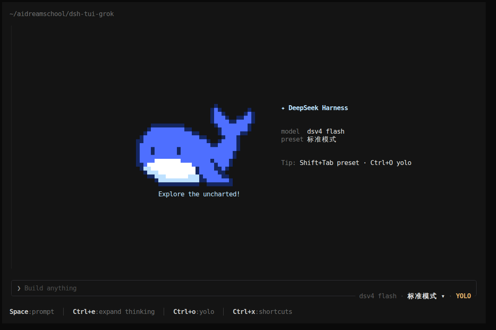

<div align="center">

# dsh-tui-grok

**A native terminal experience for DeepSeek Harness.**<br>Grok Build-inspired interaction × Rust TUI × the native DSH backend.

[简体中文](README.md) · [English](README.en.md)

[](https://github.com/Gitofxiongxiong/dsh-tui-grok/actions/workflows/ci.yml) [](https://www.npmjs.com/package/@dsh-pager-grok/cli)  [](#license-and-attribution)

[Quick start](#quick-start) · [Highlights](#highlights) · [Everyday commands](#everyday-commands) · [Contributing](#contributing)

</div>



<p align="center"><sub>Welcome screen from the current repository source; the UI and commands may be ahead of npm 0.1.0.</sub></p>

`dsh-tui-grok` is a native terminal frontend for
[DeepSeek Harness](https://github.com/deepseek-ai/deepseek-harness). DeepSeek Harness
continues to own sessions, models, and tool execution; a Rust pager provides a compact
terminal experience using the interaction and visual language of Grok Build.

> [!NOTE]
> This is an unofficial community project and is not affiliated with DeepSeek or xAI.
> It does not bring the Grok agent runtime into DSH; the two sides meet at an explicit
> adapter boundary.

## Why this project

Terminal AI tools often make you choose between raw logs and a heavyweight full-screen
chat app. This project keeps native scrolling and keyboard-driven workflows while
presenting reasoning, tool calls, background work, session history, and
interactive questions through one consistent TUI.

| Capability | What it delivers |
|---|---|
| **Native terminal UI** | Rust + ratatui rendering with keyboard, mouse, selection, copy, scrolling, and resize support. |
| **Visible agent workflows** | Structured reasoning, tool calls, queues, questions, background tasks, and subagents. |
| **Grok-style interaction** | Reuses its prompt, picker, modal, status, scrollback, and shortcut designs. |
| **DSH stays authoritative** | Sessions, events, permissions, and effects come from DeepSeek Harness—not invented UI state. |
| **One-command install** | The npm CLI carries pinned DSH and pnpm runtimes plus a prebuilt binary for your platform. |
| **Session management** | Starts new by default; resume stable sessions through the native picker, search, or explicit `--resume`. |

## Quick start

Requirements: Node.js `^22.19.0` or `>=24.0.0`, plus a DeepSeek API key.

```bash
npm install -g @dsh-pager-grok/cli
dsh-pager
```

On first launch, the CLI prepares an isolated family profile such as
`dsh-pager-grok-apiproxy-v1`. You do not need to copy or modify a DeepSeek Harness
checkout. Before launching public version `0.2.2`,
provide an API key through the DeepSeek Harness credential layer—for example with
`DEEPSEEK_API_KEY` or an existing `$DSH_HOME/.credentials.yaml`.

> [!IMPORTANT]
> Starting with npm `0.2.1`, launching without a session flag creates a new conversation.
> History requires explicit `--resume`/`--continue` or `/resume` in the TUI; `--new`
> remains as a compatibility flag.

You can also run a preflight check that never prints secret values:

```bash
dsh-pager doctor
```

## Highlights

- **Structured conversations:** distinct Markdown, reasoning, tool, result, diff, and timestamp surfaces.
- **Session management:** create, search, and resume conversations with a native `/resume` picker.
- **Models and presets:** use `/model` in the TUI and switch agent presets with `Shift+Tab`.
- **Background work:** a Tasks pane collects commands, monitors, subagents, and live status.
- **Safe interactions:** approvals and questions are backed by identified Host requests, not optimistic UI fiction.
- **Terminal ergonomics:** streaming scroll, shortcuts, mouse hit-testing, selection, copy, OSC52 fallback, and resize support.
- **Product launcher:** `doctor`, `update`, `repair`, and `uninstall`; uninstalling keeps session history.

## Everyday commands

### npm 0.2.2

| Command | Purpose |
|---|---|
| `dsh-pager` | Start a new conversation by default |
| `dsh-pager --resume` | Resume the latest top-level session in the current directory; fail clearly if none exists |
| `dsh-pager --resume <session-id>` | Resume a specific session |
| `dsh-pager --continue` | Alias for `--resume` without an ID |
| `dsh-pager --new` | Compatibility flag for explicitly creating a new session |
| `dsh-pager --session <session-id>` | Open a specific session |
| `dsh-pager --session-search <query>` | Search and open session history |
| `dsh-pager doctor` | Check Node, native package, DSH profile, and runtime |
| `dsh-pager update` | Reconcile the profile runtime with the installed CLI version |
| `dsh-pager repair` | Back up a broken profile by renaming it, then rebuild |
| `dsh-pager uninstall` | Remove the product profile runtime while keeping sessions |

The public TUI also includes a `/resume` session picker, `/timestamps`, and the `Ctrl+G` Tasks pane.

### TUI shortcuts

| Action | Purpose |
|---|---|
| `/login` | Store or replace the DeepSeek API key |
| `/new` | Start a blank session and choose an agent preset |
| `/resume` | Open the session history picker |
| `/model` | Select the active model and effort |
| `Shift+Tab` | Switch agent presets |
| `Ctrl+O` | Toggle YOLO permission mode |
| `Ctrl+G` | Toggle the Tasks pane |
| `Ctrl+X` | Show contextual shortcuts |

## Supported platforms

| OS | Architecture | Status |
|---|---|---|
| Linux glibc | x64, arm64 | Supported |
| macOS | Intel x64, Apple Silicon | Supported |
| Windows | x64 | Supported |
| Alpine / Linux musl | — | Not yet supported |
| Windows on ARM | arm64 | Not yet supported |

Native binaries are selected through npm `optionalDependencies`; the first launch does
not download a binary from GitHub Releases.

## How it works

```text
DeepSeek Harness backend / profile
              │
              │ JSON-RPC + authoritative DSH state
              ▼
@dsh-pager-grok/runtime-<family> (TypeScript adapter)
              │
              │ DSH-neutral protocol
              ▼
dsh-pager (Rust host) ──► Grok-derived views ──► terminal
```

This is an independent, out-of-tree adapter. It does not require changes to the
DeepSeek Harness checkout and does not copy the Harness repository. See the
[architecture](docs/ARCHITECTURE.md) and [external plugin guide](docs/EXTERNAL_DSH_PLUGIN.md)
for the detailed boundary.

## Project status

The current public release is
[`0.2.0`](https://github.com/Gitofxiongxiong/dsh-tui-grok/releases/tag/v0.2.0),
published on 2026-08-31; all seven public npm packages resolve to `latest=0.2.0`.
This release uses a registry-driven multi-version architecture: `0.1.1-rc.2` is the
default supported npm family, `0.1.0-rc.8` remains in maintenance, and
`0.1.2-alpha.1` is the experimental/source-only controllers-v2 development family.
See the generated [support table](docs/DSH_SUPPORT.md) for exact tags, commits,
distribution, and profile schemas. Unlisted versions fail closed before the pager starts.

When switching a pager-managed profile across adapter families or schemas, the CLI first
backs up the complete old profile and migrates only allowlisted pager settings. Sessions
and credentials are not read or modified; the legacy projection cache is not migrated and
remains only in the backup directory.

## Local development

<details>
<summary>Build, test, and local Harness setup</summary>

```bash
corepack enable
pnpm install --frozen-lockfile

cargo check --workspace
cargo test --workspace --locked
pnpm run verify:ts
```

For source-only controllers-v2 development, the checkout must match the support table's
exact alpha tag and commit. npm ApiProxy versions use their isolated fixtures. See
[`compat/README.md`](compat/README.md) for all three repeatable matrix commands.

```bash
DSH_HARNESS_ROOT=/path/to/deepseek-harness \
  ./scripts/start-new-chat.sh
```

Check the backend/profile without creating a session:

```bash
DSH_HARNESS_ROOT=/path/to/deepseek-harness \
  ./scripts/start-new-chat.sh --check
```

More documentation:

- [Testing strategy](docs/TESTING.md)
- [Product launcher design](docs/PRODUCT_PLUGIN_LAUNCHER.md)
- [Source and license policy](docs/SOURCE_POLICY.md)
- [Migration plan](docs/MIGRATION_PLAN.md)

</details>

## Contributing

Use [GitHub Issues](https://github.com/Gitofxiongxiong/dsh-tui-grok/issues) for bugs,
experience reports, and feature ideas. Helpful reports include your OS, terminal,
Node.js version, reproduction steps, and redacted `dsh-pager doctor` output.

If this makes DeepSeek Harness better in your terminal, please give the project a
[⭐ Star](https://github.com/Gitofxiongxiong/dsh-tui-grok). It helps more terminal and
AI tooling enthusiasts discover the project.

## License and attribution

The project itself is dual-licensed under [MIT](LICENSE-MIT) or
[Apache-2.0](LICENSE-APACHE). Grok-derived files retain their source, copyright, and
license metadata; see [`SOURCE_MANIFEST.md`](crates/dsh-pager-grok-ui/SOURCE_MANIFEST.md)
and [`vendor/grok/LICENSE`](crates/dsh-pager-grok-ui/vendor/grok/LICENSE).
