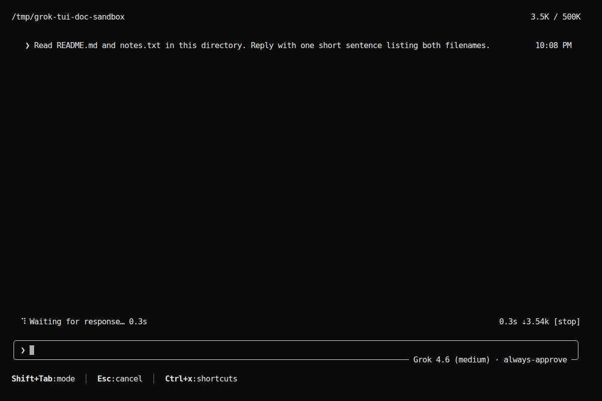
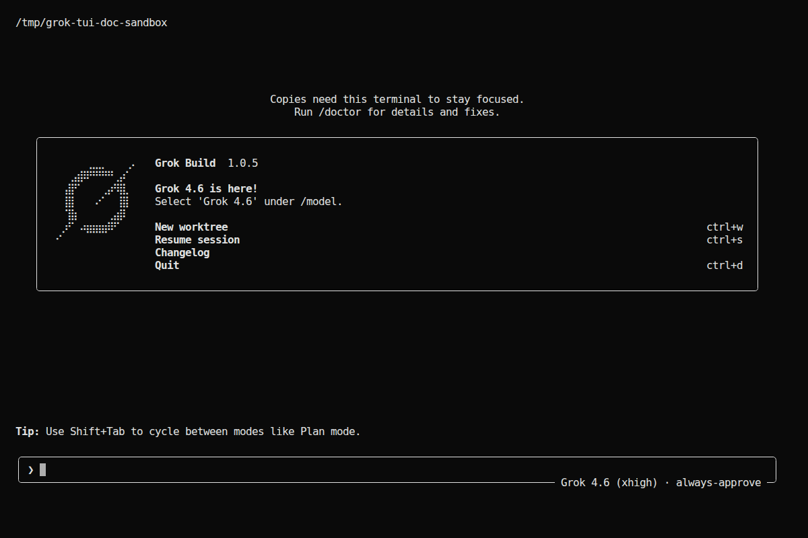
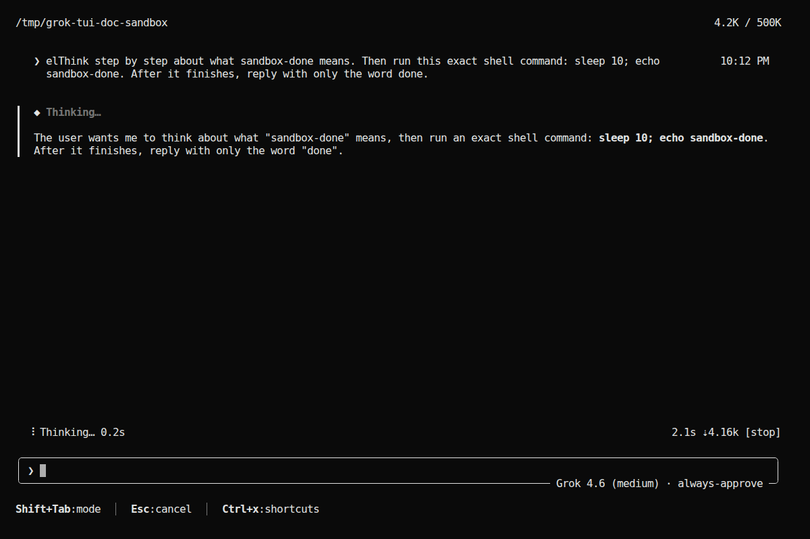
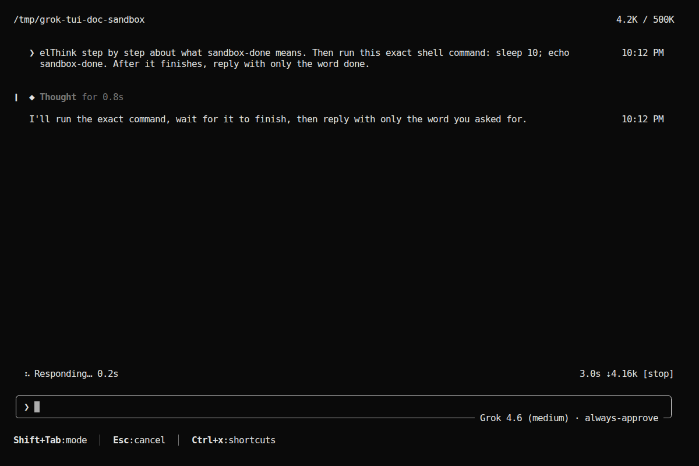
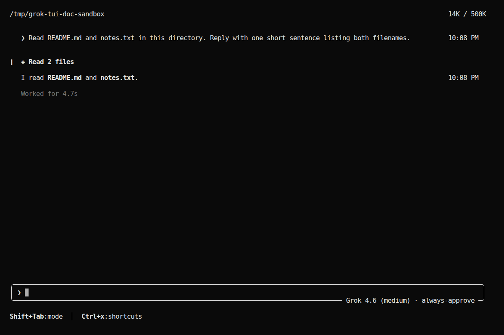
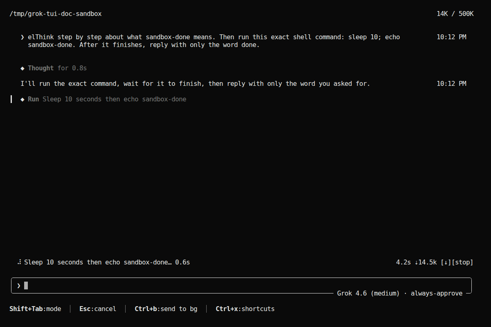
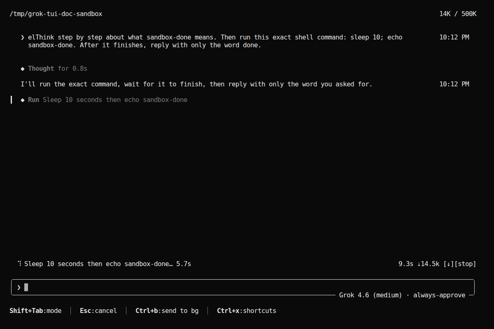
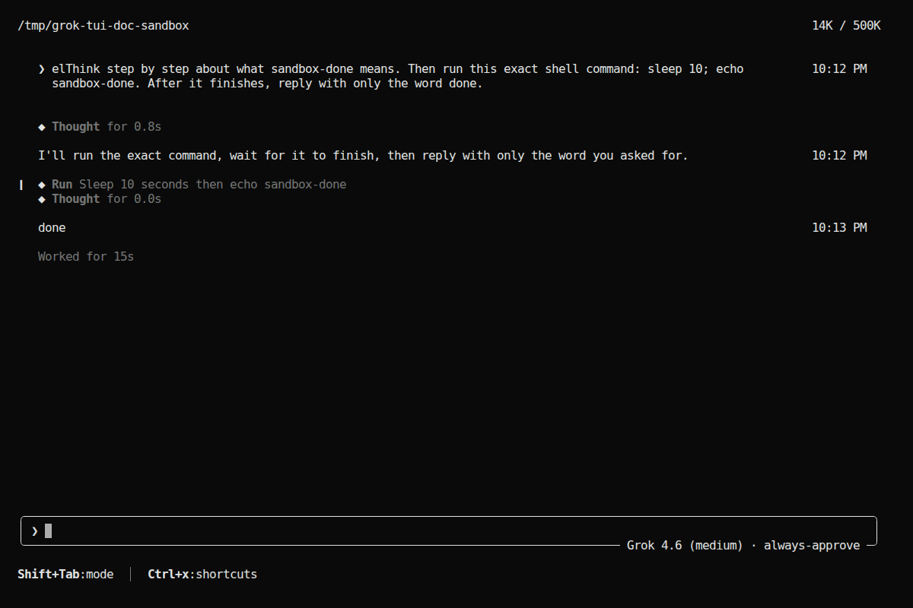

# Grok TUI 转录表面：用户消息、思考、工具调用

> 用途：DSH pager 与 Grok Build TUI 做视觉/交互对齐时的功能点契约。
> 上游：`/home/leo/aidreamschool/grok-build`（pager crate `xai-grok-pager`）。
> 证据：源码 + 本机 `ttyd + xterm.js + Playwright` 对隔离 sandbox 会话的 `.xterm` 截图。
> 截图会话：`grok --always-approve --effort medium --cwd /tmp/grok-tui-doc-sandbox`，无真实凭据。
> 第二轮 prompt 被脚本误键入了前缀 `el`，只影响用户文案，不影响 chrome 语义。

相关但职责不同的文档：

- `GROK_MESSAGE_PRESENTATION_AND_STREAM_FIX_PLAN.md`：block 分类、流终结、fold/group 投影。
- `GROK_RENDERER_PIXEL_PARITY_PLAN.md`：renderer 像素目标。
- 本文：人眼看到的 **transcript chrome**——左侧竖条、右侧时钟、思考/工具/用户消息的状态机和交互。

## 1. 结论先行

Grok 的 transcript 不是“三种气泡”。每条历史是一个 `RenderBlock`，由 `EntryRenderer` 套上统一 chrome：

```text
[accent 1col] [pad] [bullet + content … timestamp overlay] [pad]
```

三类对话对象用完全不同的 chrome：

| 对象 | 左侧竖条 | 右侧时钟 | 默认折叠 | 运行中动效 |
|---|---|---|---|---|
| 用户消息 `UserPrompt` | 无（accent 列填成 prompt 底色） | 有 `h:mm AM/PM` | 超过 3 视觉行才可折叠 | 无 |
| 思考 `Thinking` | 运行中/截断展开时有 `┃` 行波 | 无 | 运行中 Truncated；完成后 Collapsed 一行 `Thought for Xs` | 竖条+菱形 bullet 同步行波 |
| 工具 `ToolCall` | Execute 等有；Read/Search/ListDir/Edit 默认无 | 无 | 多数 Collapsed 摘要行 | Execute/部分工具 `┃` 行波；Read 靠 VerbRun header |
| Agent 正文 `AgentMessage` | 无 | 有，同用户消息 | 不可折叠 | 无 |

用户口语里的“正在思考/跑工具时左边竖条会闪”，Grok 源码里不是开关闪烁，
而是 **accent rail 的 `sin²` 行波**。DSH S1 已恢复同一固定空间相位和速度；
仅把 runtime 的单调经过时间确定性换算为约 30 FPS tick，不修改上游公式：

- 多行思考块：高光沿 `┃` 往下走。
- 单行工具摘要：同一公式作用在一行上，看起来就是竖条明暗闪烁。
- 完成瞬间还有 **400ms 静态闪一下**（`FINISH_FLASH_DURATION_MS`），Read 这种平时没有 rail 的工具也会闪绿。

用户口语里的“右边有这条消息什么时候发生的”，只出现在 **UserPrompt / AgentMessage / Btw** 第一行右侧，默认 `  10:08 PM`。它不是思考耗时，也不是整轮结束时刻。Grok ACP 和 DSH 的数据来源不同，DSH 适配遵守下面单独的事件契约：

- 用户消息：DSH `user/message` 被 host 接受并进入转录时的 `SessionEvent.time`。
- Agent 正文：DSH 每个 Agent surface 收到**第一个非空文本 delta** 的 `assistant/chunk.time`。工具把当前 Agent surface 关闭后，下一段正文会再打一个新时钟。

思考耗时写在标题 `Thought for 0.8s` 里，不占右边。工具自己的 `elapsed_ms` 不画在 scrollback。

底部 `TurnStatus` 是第三条时间轴：左边相位 `Thinking… 0.2s`，右边整轮 `2.1s ⇣4.16k [stop]`。

## 2. 渲染链

```text
ACP/session event
  → AgentView 选择 RenderBlock
  → ScrollbackState.push / chunk / finish
  → ScrollbackEntry { id, block, is_running, display_mode, created_at, finished_at }
  → layout + VerbRun/Truncation group scan
  → EntryRenderer（accent、bullet、vpad、timestamp、group header）
  → BlockRenderer（block.output）
  → ScrollbackPane + TurnStatus + Prompt
```

关键文件：

| 职责 | 路径 |
|---|---|
| block 枚举 | `crates/codegen/xai-grok-pager/src/scrollback/block.rs` |
| 用户消息 | `.../scrollback/blocks/user.rs` |
| 思考 | `.../scrollback/blocks/thinking.rs` |
| 工具 sum type | `.../scrollback/blocks/tool/mod.rs` |
| Execute / Read | `.../tool/execute.rs`、`read.rs` |
| chrome 绘制 | `.../scrollback/wrappers/entry_renderer.rs` |
| 行波公式 | `xai-grok-pager-render/src/theme/tokyonight.rs` `wave_brightness` |
| 字形 | `xai-grok-pager-render/src/glyphs.rs` `accent_bar` `collapsed_accent` `prompt_arrow` `diamond_filled` |
| 底部活动条 | `.../views/turn_status.rs` |
| 外观默认 | `xai-grok-pager-render/src/appearance/config.rs` `ThinkingConfig` |

每帧 `tick` 约 30fps。只要存在 `animated` accent 或 running entry，scrollback 会持续重绘。

## 3. 用户消息

### 3.1 外观

- 前缀：`❯ `（`glyphs::prompt_arrow`，legacy ConHost 为 `> `）。`!` bash 是 `$ `，cron 是 `↻  `。
- 正文：`theme.text_primary`；识别到的 skill/slash token 用 `accent_skill`。
- 底带：`accent_background=true`，RGB 主题用 `bg_light`，把 accent 列也填成同一底，所以 **用户消息没有独立竖条**。
- 上下 vpad：默认开，compact prompt 时关。
- 右侧：`created_at` 的短时钟，见第 8 节。

发送后立刻成为 transcript 的一条 `UserPrompt`，不会再流式改写。



### 3.2 状态

| 状态 | 行为 |
|---|---|
| 短消息 | `Expanded`，完整换行 |
| 视觉行 > 3 | `is_foldable`，默认 `Collapsed`，最多 3 行，末行 ` …` |
| 选中 | 底带在 terminal-native 下升到 `Gray` |
| 输入框草稿 | 还不是 transcript。见 idle/输入截图 |



### 3.3 交互

- 单击：选中。
- 双击：若可折叠则切换 fold。
- 前缀 `❯ ` 不可复制。
- 不是 VerbRun 成员，会打断工具分组。

## 4. 思考过程

### 4.1 运行中

默认 `DisplayMode::Truncated`：

```text
┃ ◆ Thinking…
┃   <markdown 正文，bg_blend=0.7，默认可选 header>
```

- 标题：`Thinking…`（U+2026），`primary().bold()`。
- 左侧：`ThinkingConfig.animate=true` 且 `is_running` 时 `AccentStyle::animated(accent)`。
- bullet `◆` 与 rail 共用 `wave_brightness`，会一起闪。
- 正文超过 `truncated_lines`（默认 3）时先画一行 `…` 再画最后 N 行。
- **没有右侧时钟**。
- `show_thinking_blocks=false` 时高度为 0，历史不删除。



约 0.4s 后同一块：正文未变，底部相位从 `0.2s` 变成 `0.6s`。多行 `┃` 上的行波在静帧里不易看清，但单行亮度已在变。


### 4.2 完成后

`finish()` 冻结本地耗时（replay 用服务端 `agentTimestampMs - streamStartMs`）。
`finished_display_mode = Collapsed`：

- 标题：`Thought` + ` for 0.8s`（`<60s` 用 `{:.1}s`，否则 `{m}m{s:.0}s`）。
- **Collapsed 时 `accent()` 返回 None**：稳定态没有高 `┃`。
- 刚结束 400ms 内仍会 `recently_finished` 闪一条静态竖条。



### 4.3 折叠循环

运行中：`Collapsed|Truncated → Expanded → Truncated`（运行中不能收成只有标题，避免正文消失）。
完成后：`Collapsed ↔ Expanded`。

`Ctrl+E` 是全局显示/隐藏思考，不是单条 fold。最小模式才会在折叠标题后附加 `(ctrl+e to expand)`。

### 4.4 分组

完成后的 collapsed thinking 可以作为 `ThoughtMember` 并入旁边的工具 VerbRun，**不计入** “Read 2 files” 的数字。运行中或展开的 thinking 是 Transparent，不进组。

## 5. 工具调用

`ToolCallBlock` 是 sum type。折叠、accent、完成态都委托给变体。bullet 由 appearance 的 tool bullet（默认菱形）统一前置。

S5 后这不再只是 Grok 行为说明：DSH production 已通过
`scrollback_adapter::project_tool` 投到 vendor
`ToolCallBlock::{Execute,Read,Edit,ListDir,Search,WebFetch,WebSearch,Other}`，再由同一
tool family 输出 header/detail/accent；`transcript.rs` 不再有平行
`render_tool_call`。只有 DTO 映射留在 adapter，vendor 文件不引用 `dsh_pager`。
Grok tool execution、MCP/hook/media process 与 edit 的全文件 syntect/source-map
worker没有 DSH 中性真源，按 B/D 边界排除；它们不是继续在 view 中自写的理由。

### 5.1 各变体标题（collapsed 一行）

| 种类 | 标题形态 | 默认折叠 | 运行中左侧 `┃` |
|---|---|---|---|
| Read | `Read path`，可选 `(1-10)` / `(empty)` / `(image)`；SKILL.md 为 `Skill name` | Collapsed | 无（完成闪绿 400ms） |
| Execute | Label：`Run [description\|command]`；有 description 时 collapsed 不露出 `$ cmd` | Collapsed；`!` bash 为 Truncated | 有，行波 `running_accent` |
| Edit | `Edit` / `Creating` + path + hunk 统计 | 按变体 | 配置可选 |
| ListDir | `List path (N entries)` | Collapsed | 无 |
| Search | `Search "pattern"` | Collapsed | 无 |
| WebFetch / WebSearch | `Fetch` / `Web Search` | Collapsed | 有 |
| MCP use_tool | Server + Action | Collapsed | 有 |
| 失败 | 红 bullet；Execute 红 rail | 视变体 | 静态 `accent_error` |

Execute 完成：**不**强制改 fold。用户展开过就保持；没展开就保持折叠。`!` bash 完成强制 Expanded。

### 5.2 VerbRun 分组

连续 collapsed 的 tool/subagent 合成一行：

```text
❙  ◈ Read 2 files
```

- 运行中：header 左侧改回 `┃` 并走 `accent_tool` 行波。
- 完成后：细 `❙`（`collapsed_accent`）+ 半透明。
- 失败：红 `┃`。
- 现在时/过去时：`Reading` / `Read`，`Running` / `Ran`，见 `VerbGroupKind::verb`。



### 5.3 运行中的 Execute

collapsed 仍画一条 rail，因为 Execute 的 `accent()` 在 `is_running` 时是 animated。单行 rail + `sin²` = 竖条闪烁。

底部 TurnStatus 用工具 description：`Sleep 10 seconds then echo sandbox-done… 0.6s`，右侧整轮计时、`[↓]` 送后台、`[stop]`。快捷键出现 `Ctrl+b:send to bg`。



约 5 秒后同一行仍在跑，相位 `5.7s` / 整轮 `9.3s`。竖条还在。



### 5.4 展开后的 Execute

Expanded/Truncated 才出现 `$ command`、空行、terminal output 面板。truncated 默认首 2 + 末 3 行。单击只选中，**双击**才在 collapsed ↔ 详情之间切换。

## 6. Agent 正文

`AgentMessageBlock`：Markdown 流式追加到同一 block，默认 Expanded，不可折叠。
无左侧 rail，有右侧时钟。代码块/mermaid 走自己的 affordance，不改变这条 chrome 规则。

一轮结束还有 `SessionEvent`：`Worked for 15s`（muted，无时钟 overlay）。



注意第 9 张图里的时间：

- 用户消息 `10:12 PM`
- 第一段 Agent `10:12 PM`
- 最终 `done` `10:13 PM`（跨分钟）
- 思考只有 `Thought for 0.8s` / `0.0s`，右侧空白
- `Run …` 右侧也空白

这就是“消息发生时刻”和“思考耗时”必须分开对齐的证据。

## 7. 左侧竖条（accent rail）

字形：

- 运行/静态满色：`┃` U+2503（`accent_bar`；legacy `│`）
- 折叠可分组且未选中：`❙` U+2759（`collapsed_accent`），颜色 `dim_accent=0.5`

Grok 基线公式（`entry_renderer.rs` `WAVE_SPEED=0.15`，`wave_rows=32`）：

```text
brightness = sin²(tick * 0.15 + row_phase)
period ≈ π / 0.15 ≈ 21 ticks ≈ 0.7s  （30fps）
```

DSH production 使用同一公式；adapter 只负责把单调时间转成 tick：

```text
tick = floor(elapsed_seconds * 30)
row_phase = 2π * logical_row / 32
brightness = sin²(tick * 0.15 + row_phase)
```

rail 实际长度不进入周期；单点可见明暗周期约 0.7 秒，多行通过固定 32 行相位
呈现空间行波，单行工具摘要自然退化为同公式的明暗脉冲。渲染仍保持 33ms poll
以保证平滑度，实际相位来自 `Instant` 而不是重绘计数，所以输入或通知导致的
额外重绘不会加速行波。S2 已接入 `AccentStyle + Appearance`：thinking rail 使用
`ThinkingConfig.accent = gray_dim`，running execute 使用
`ExecuteConfig.running_accent = accent_running`；颜色与公式现在分别由 appearance
和 EntryRenderer 拥有，不能再通过修改公式或引入 `rail_len` 补偿。

S3/S4 同步完成了生产 renderer/message-block 接线；S5 又把全部 DSH-presentable
tool family 与 verb-group 接入同一 chrome。accent 列、`◆` bullet、prompt vpad/
背景由 `EntryRenderer`/`BlockRenderer` 物化，`Thinking…`、`Thought for Xs`、last-N
截断及 user/agent/tool 输出来自 vendor B 闭包。S6 第一条生产纵切现已用 host
content revision + borrowed entry + Fenwick paint window 把 hot frame 限制到
viewport/overscan，并由 `EntryRenderer` 直接写 `Buffer`；旧 `Paragraph<Vec<Line>>`
和 runtime timestamp 双路径已删除。S6A2 又让 host 发布有界 content delta：50k
历史上连续 `assistant/chunk` 原位更新只重投影变化 entry，8 次 revision 合计扫描
8 个 metadata、0 个新 rich materialization；追加/删除/重排或 tool/thinking/context/
pending 等邻接敏感变化仍显式回退全量语义同步。sticky 目前只有已测试的纯坐标闭包，
尚未接入 production；最终 `RichTranscript` 收尾仍属于 S6–S7，不能据此宣称整个
N2/pixel parity 已闭包。

特殊态：

| 条件 | 竖条 |
|---|---|
| 运行 + animated | 行波 |
| `is_pending_user_input`（审批/提问） | **冻结**满色，表示停在你这边，不是 loading |
| 完成 400ms 内，且 block 是 Tool/Thinking | 静态闪（Read 用 `accent_success`） |
| 用户/Agent | 列被清成底色 |
| 最小模式 `hide_accent` | 整列宽度 0 |

可展开指示：选中且处于最小 fold 时，菱形可换成 `›`；运行中最小 fold 的指示符继承 animated 颜色。

## 8. 右侧消息时间戳

只给 `UserPrompt | AgentMessage | Btw`。思考、工具、SessionEvent 都没有这个 overlay。

### 8.1 画在哪、长什么样

- 开关：`appearance.show_timestamps`，默认 **true**；它是本地 UI 状态，不产生 DSH RPC。`/timestamps` 命令保留为后续独立切片。
- 预留 10 列，正文按 `content_width - 10` 换行，避免和 overlay 撞字。
- 默认：`created_at.format("  %-I:%M %p")` → `  10:08 PM`，`theme.gray`。
- 鼠标落在该行最右 10 列：改成 `  %H:%M:%S | %b %d`，例如 `  22:08:13 | Aug 24`。
- DSH 字段：`DshRenderEntry.created_at_ms` / `ScrollbackEntry.created_at_ms`，保存权威事件的 Unix epoch milliseconds。旧 fixture 或明显无效的时间会保持 `None`，不使用恢复会话时刻伪造历史时间。

本次截图打到默认短格式。`09-turn-complete.png` 里同一轮有三个时钟：用户 `10:12 PM`、第一段 Agent `10:12 PM`、工具跑完后的 `done` `10:13 PM`。hover 扩写 Playwright 未稳定命中，扩写格式以源码为准。

### 8.2 触发点：用户消息

时钟标记的是 **UserPrompt 这条气泡进入 scrollback 的时刻**，不是开始打字，也不是点 Enter 后还在队列里排队的时刻。

Live（本机发出、正在跑的 turn）：

1. `maybe_drain_queue` / `apply_turn_start_shim` 把队列头变成 running turn。
2. 立刻 `push_block(RenderBlock::user_prompt(...))`（或多段 combined 各画一条）。
3. `ScrollbackEntry::with_id` 把 `created_at` 设成 **这一帧的 `Local::now()`**。
4. `start_turn` → `expect_user_echo()`，ACP 回声不再新建气泡。
5. live 回声 **不会**改 `created_at`（`handle_user_message` 只在 `meta.is_replay` 时用服务器时间覆盖已有气泡）。

所以用户右侧时钟 ≈ **这条 prompt 真正开跑、乐观气泡画出来的墙钟**。若上一条还在跑、这条还在 queue pane，transcript 上还没有这条消息，也就还没有时钟。Send-now / 插话走 `push_send_now_user_block`，时钟是那次立即 `push_block` 的本地现在。

DSH replay / 历史恢复：

- `SessionEvent.time` 已经持久化在 session history，presentation adapter 在 live 和 replay
  两条路径上使用同一个值。
- 因此回放里用户时钟是 **`user/message` 被写入 history 的时刻**，不是本机打开 `/resume`
  的时刻，也不是 UI 重建 projection 的时刻。

| 不是这个点 | 原因 |
|---|---|
| 输入框出现草稿 | 还不是 `UserPrompt` |
| 只入队、未 drain | 气泡还没 push |
| 思考开始 / 首个工具 | 用户时钟已经定了，不再改 |
| 整轮 `Worked for Xs` | 那是 SessionEvent，无右侧时钟 |

### 8.3 触发点：Agent 正文

时钟标记的是 **这一条 Agent 表面第一次出现非空文本** 的时刻，不是 turn 开始，也不是正文流式结束。

Grok ACP 的 `handle_agent_chunk` 与 DSH adapter 都遵守相同的 surface 不变量：

1. 收到非空文本；若还没有当前 Agent surface，就新建 running surface。
2. 第一个非空文本 delta 写入时间；DSH 使用该事件的 `time`，Grok ACP 使用
   `agentTimestampMs`。
3. 后续 delta 只追加内容，**不再改** `created_at`。
4. 工具调用会关闭当前 Agent surface。工具之后再来的正文会开新的 surface，并使用新的稳定 surface ordinal 和时间。

DSH 的 `assistant/chunk.time` 是 Harness 写入事件时的 UTC epoch milliseconds。live 和 replay
都使用该权威值；事件缺失/无效时 adapter 保持 `None`，避免用本机现在覆盖历史。测试覆盖
第一个非空文本、后续 delta 不更新以及工具边界的新 surface。

这就是 `09-turn-complete.png` 里两段 Agent 时钟不同的原因：`I'll run the exact command…` 在 sleep 之前打点（`10:12 PM`）；工具结束后的 `done` 是新表面，打在 `10:13 PM`。中间的 `Thought for` 和 `Run Sleep…` 右侧没有时钟。

| 不是这个点 | 原因 |
|---|---|
| 用户发送 / `turnStartMs` | 那是用户气泡（回放）或整轮起点，不是 Agent 正文 |
| `Thinking…` 出现 | 思考块没有右侧时钟 |
| 工具开始或结束 | 工具无 overlay；只是结束当前 Agent 表面 |
| 最后一个 token / `finish_running` | 不刷新 `created_at` |
| `Worked for Xs` | SessionEvent，无 overlay |

Btw（`/btw`）与 Agent 正文同类，走同一套 overlay 资格；触发仍是该 Btw entry 被 push 的时刻。

## 9. 底部 TurnStatus

位于 scrollback 和 prompt 之间，空闲高度 0。

```text
⠧ Thinking… 0.2s                          2.1s ⇣4.16k [stop]
```

| 区域 | 内容 |
|---|---|
| 左 spinner | Braille `⠋⠙⠹⠸⠼⠴⠦⠧`，约 7.5fps |
| 相位文案 | `Thinking…` / `Responding…` / `Waiting for response…` / 工具 description / `Compacting…` / `Retrying…` |
| 相位计时 | 当前 activity 开始后的 elapsed |
| 右整轮计时 | 本 turn 开始后的 elapsed |
| `⇣Nk` | 本轮 token |
| `[stop]` | 取消；hover 变红 |
| `[↓]` | 工具跑得久时可送后台 |

“等模型”和“思考”不是同一相位：先 `Waiting for response…`，思考 token 到达后变成 `Thinking…`，出正文变 `Responding…`，跑 bash 变 description。

等用户（权限/提问）时不用行波 rail，而用 **脉冲菱形**（`USER_WAITING_PULSE_SPEED=0.08`，约 1.3s 一圈），颜色 `accent_user`。

## 10. 交互矩阵

必须按 Grok 的 click-count 实现，单击不能偷偷 fold。

| 手势 | 普通 entry | UserPrompt | VerbRun / N more header | 运行中 thinking/execute |
|---|---|---|---|---|
| 单击 | 选中 | 选中 | 选中 header | 选中，不展开 |
| 双击 | foldable 则切换 fold | 可折叠则切换 | 展开/收起整组 | Execute/thinking 按 `next_fold_mode` |
| 三击 | fold + 滚到顶 | 走 prompt fold | 不重复切换组 | 由 selection owner 处理 |
| `h` / Left | 收 | 收 | — | 运行中 thinking 收到 Truncated |
| `l` / Right | 展 | 展 | — | 展到 Expanded |
| `e` | 切换选中 fold | 同左 | — | 同 `next_fold_mode` |
| `Ctrl+E` | 全局思考显示 | — | — | 清 thinking pin |
| `r` | raw markdown | 无 | — | thinking/agent |
| `y` / `Y` | 复制正文 / meta（命令、路径） | 正文 | 不含 header chrome | Execute meta 是命令 |
| `Enter` | 全屏 viewer | — | — | 详情进 viewer |

拖选复制必须丢掉装饰：blockquote 的 `│ `、tool header 前缀、diff gutter、VerbRun chrome。

## 11. DSH 对齐检查清单

实现或验收时逐项看，不要用“差不多像”代替：

1. 用户消息：`❯ ` + 底带 + 可选 vpad + 右侧短时钟；没有 `┃`。
2. 思考运行：`◆ Thinking…` + 多行 `┃` 行波 + 无右侧时钟 + 底部 `Thinking… Xs`。
3. 思考完成：一行 `Thought for Xs`，稳定态无 `┃`；400ms 闪一下允许。
4. Read 连续调用：合成 `Read N files`，细 `❙`；成员默认不展开。
5. Execute 运行：`Run {description}` + 单行 `┃` 明暗闪 + TurnStatus 用 description 计时。
6. Execute 完成：保持用户 fold；双击才出 `$ cmd` 和 stdout 面板。
7. Agent 正文：无 rail，有时钟；和 UserPrompt 不能共用同一 background。
8. 时钟只出现在 User/Agent/Btw。DSH 用户时钟 = 被接受的 `user/message.time`；Agent 时钟 = 该表面第一个非空 `assistant/chunk.time`。工具会切断 Agent surface，下一段正文重新打点。hover 才从 `h:mm AM/PM` 扩到 `HH:mm:ss \| MMM DD`。
9. 单击选中、双击 fold；权限等待时 rail 冻结而不是继续闪。
10. 浏览器证据必须截 `.xterm`，不能用 `/cut` 或 PTY 文本代替最终像素。

## 12. 截图索引

全部来自隔离 sandbox，1200×800、DPR 1、DejaVu Sans Mono 16px、`TERM=xterm-256color`。

| 文件 | 状态 |
|---|---|
| `assets/grok-tui-transcript/01-idle-welcome.png` | 空会话欢迎 + prompt |
| `assets/grok-tui-transcript/02-user-message-waiting.png` | 用户消息 + `10:08 PM` + Waiting |
| `assets/grok-tui-transcript/03-tool-group-complete.png` | `Read 2 files` 分组 + Agent + Worked for |
| `assets/grok-tui-transcript/04-thinking-running-a.png` | `Thinking…` + 左侧 `┃` |
| `assets/grok-tui-transcript/05-thinking-running-b.png` | 同一思考稍后帧 |
| `assets/grok-tui-transcript/06-thinking-collapsed-responding.png` | `Thought for 0.8s` + Responding |
| `assets/grok-tui-transcript/07-execute-running-a.png` | `Run Sleep…` 运行中 |
| `assets/grok-tui-transcript/08-execute-running-b.png` | 同一 Execute 约 5s 后 |
| `assets/grok-tui-transcript/09-turn-complete.png` | 思考/工具/多条时钟/Worked for |

未稳定截到：时间戳 hover 长格式、Read 单条展开后的带行号正文、权限卡冻结 rail。这三项以第 7–10 节源码为准，补拍时另开进度记录。

S5 的工作区外最终证据位于 `/tmp/dsh-grok-s5-browser-20260825/`：DSH Edit
collapsed/expanded、Read+Search verb-run collapsed/expanded、真实 Grok Edit+Read、
并排图、绝对像素 diff、screen text、browser errors 和 `result.json`。两端固定
1200×800、DPR1、DejaVu Sans Mono 16px；browser errors 全空。整屏 diff 主要来自
DSH fixture 固有的 Tasks/Subagents/Queue 与 Grok 的 Thought/timestamps/Worked-for，
以及 manifest 已声明的 typed `+/-` diff 对 contextual hunk/syntect 排除；不能把该
diff 比率解释为 S7 parity 分数。
