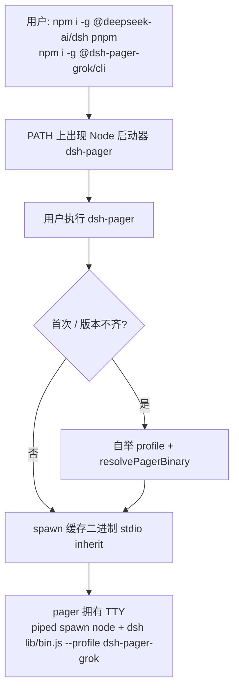
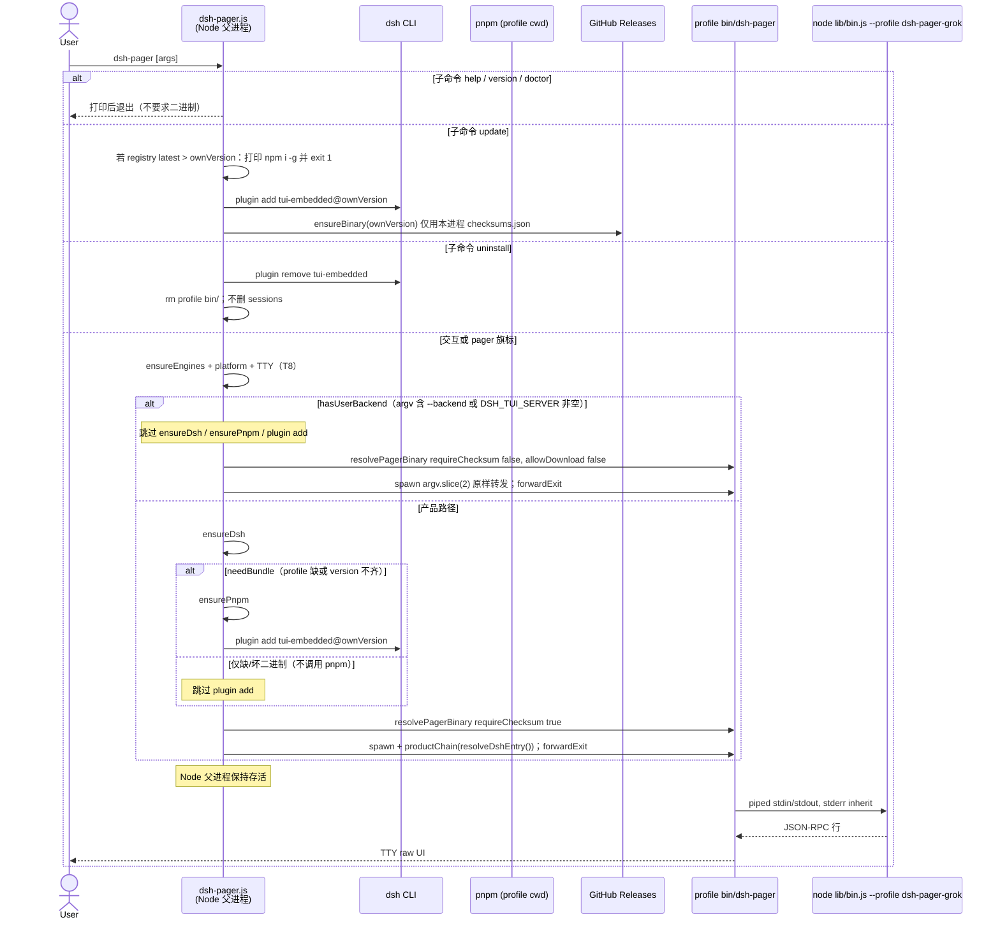
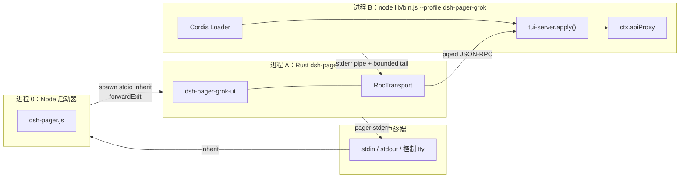

# 树外 DSH 插件 + 产品启动器：`dsh-pager`（dsh-tui-grok）

> [!IMPORTANT]
> **状态：历史方案参考。** 本文中“peer 钉死 `0.1.0-rc.8`、单一 runtime
> Bundle”的设计已被 [DSH 多版本兼容方案](DSH_MULTI_VERSION_COMPATIBILITY_PLAN.md)
> 的 D1/D3 决策取代：首个 npm 默认后端迁移到 `0.1.1-rc.2`，并由
> family-specific runtime 与 support registry 管理支持窗口。正文保留用于历史审计，
> 不代表多版本架构的当前规范。

| 字段 | 值 |
|---|---|
| 标题 | 树外 DSH 插件 + 产品启动器：`dsh-pager`（dsh-tui-grok） |
| 作者 | TBD |
| 日期 | 2026-08-26 |
| 状态 | Revised Draft（推荐 v2；原 v1 作为审计基线保留） |
| 仓库 | `/home/leo/aidreamschool/dsh-tui-grok`（`git@github.com:Gitofxiongxiong/dsh-tui-grok.git`） |
| 硬约束 | 任何代码不得进入官方 `deepseek-harness` 仓库；不得宣称官方 `dsh tui` 子命令 |

---

## Overview

`dsh-tui-grok` 已经是一套可运行的双进程原生 TUI：Rust `dsh-pager` 拥有用户 TTY，Node 侧的 Cordis 插件 `@dsh-pager-grok/tui-server` 把 stdout 当作 JSON-RPC 管道。TypeScript 四包（`tui-protocol` / `tui-server` / `tui-session-projection-recovery` / `tui-embedded`）已经按树外 DSH 插件契约实现，但启动路径仍是开发脚本：`scripts/start-new-chat.sh` **每次** `cargo build -p dsh-pager-bin --locked`；未传 `--skip-setup` 时还会经 `setup-dev-profile.sh` **每次** `pnpm run build:ts` 并把源码 `link:` 进 profile。这对贡献者可接受，对最终用户不可接受。

官方 CLI 已删除 `tui` 子命令（`apps/cli/tests/built-bin.e2e.ts` 断言 help 文本不含 `tui`，裸 `dsh tui` 退出码 1），`PROFILE_TEMPLATES` 只有 `web` 与 `headless`。因此本产品必须以外置 npm 包 + PATH 启动器形态交付。

**原 v1 用户路径（审计基线）：** 全局安装 `@dsh-pager-grok/cli` 后运行命令 `dsh-pager`。Node 启动器用 `spawn` + `forwardExit`（父进程保持存活，对齐 `dsh-TUI/bin/dsh-tui.js`）拉起缓存的 Rust 二进制；该二进制以管道 spawn **`process.execPath` + `@deepseek-ai/dsh/lib/bin.js` + `--profile dsh-pager-grok`**。首次运行把 `@dsh-pager-grok/tui-embedded@<与启动器相同的精确版本>` 装进隔离 profile，再从 GitHub Release 下载 Rust 二进制。该路径要求 PATH 上另有全局 `dsh` 和 cold path 所需的 `pnpm`。

**当前推荐路径：** 用户只需 `npm install -g @dsh-pager-grok/cli` 和 `dsh-pager`。CLI 自带与产品验证过的精确版本 DSH/pnpm，通过官方 `dsh plugin` 契约安装单一 runtime Bundle，并从 npm 的平台 `optionalDependencies` 直接启动预编译 Rust 程序。不依赖全局 DSH/pnpm，不在首启时下载 GitHub Release，不在 profile 内维护第二份二进制缓存。

---

## 2026-08-26 二次架构复审：当前推荐 v2

> 本节是当前规范性方案。后文「原 v1」章节保留用于追溯已完成的代码事实审计和取舍；若与本节冲突，以本节为准。本节是实施设计，不表示代码已完成。

### 官方插件机制与设计边界

联网与本地官方源码对照得到以下边界：

1. Cordis plugin 是真正的运行单元，由 Fiber 管理 `PENDING → LOADING → ACTIVE/FAILED` 等状态，副作用通过 `ctx.effect()` 回收。
2. Bundle 是带 `dsh.bundle.patch` 的 npm package；Profile 是有序 Bundle 栈。Bundle 层之后仍可叠加 profile patch、home patch 与 CLI overlay。
3. `dsh plugin --profile <name> add <package>` 把命令转发给 pnpm，然后根据依赖包的 `dsh.bundle.patch` 对 `dsh.profile.bundles` 做 reconcile。启动器应调用这条公开契约，不应自己手写 profile。
4. 官方只自动初始化 `web` 与 `headless` 模板；自定义 profile 不存在时直接启动会失败。官方也没有内建 `dsh tui` 命令。
5. DSH 仍是 developer preview，不承诺小版本间的稳定兼容。因此「全局 DSH 任意升级 + 版本不同只警告」不能作为产品边界。

依据：

- [DeepSeek Harness README](https://github.com/deepseek-ai/deepseek-harness)
- [Bundle README](https://github.com/deepseek-ai/deepseek-harness/blob/master/packages/bundle/README.md)
- [Package / install tutorial](https://github.com/deepseek-ai/deepseek-harness/blob/master/docs/user/develop/basic/publish.md)
- [Cordis plugin lifecycle](https://github.com/deepseek-ai/deepseek-harness/blob/master/docs/user/develop/framework/index.md)
- [CLI reference](https://github.com/deepseek-ai/deepseek-harness/blob/master/apps/cli/reference/README.md)

### 总体决策

保留双进程拓扑，替换分发与 bootstrap 层：

```text
user TTY
  └── @dsh-pager-grok/cli（只做控制面）
         ├── 首次/升级：私有 DSH + 私有 pnpm -> 官方 dsh plugin -> profile
         └── spawn npm 平台包中的 dsh-pager（唯一 TTY 所有者）
                └── piped stdin/stdout JSON-RPC
                       └── process.execPath + 私有 @deepseek-ai/dsh/lib/bin.js
                              + --profile dsh-pager-grok
```

不可破坏的边界：

- Node 启动器不渲染 TUI，Rust pager 仍是唯一 TTY 所有者。
- Node backend 的 stdin/stdout 只运输 JSON-RPC，不得继承用户终端。
- 不在 Cordis `apply()` 内启动 pager；此时 DSH 已占有标准 IO，无法再安全反转终端所有权。
- Windows backend 仍传 `node.exe + 绝对 bin.js`，Rust 不直接 `CreateProcess` `.cmd` / `.bat`。
- 用户显式 `--backend` / `DSH_TUI_SERVER` 是高级逃生口；使用时跳过产品 profile bootstrap。

### 发布单元

#### 1. `@dsh-pager-grok/cli`

唯一用户入口，并持有：

- 已验证的精确版本 `@deepseek-ai/dsh`，不用 `^` / `~`。
- 精确版本 pnpm；只在调用官方 `dsh plugin` 时把 CLI 自身 `node_modules/.bin` 放到子进程 PATH 最前面。
- 精确版本 runtime package。
- 各平台原生包的精确 `optionalDependencies`。

CLI 不通过 `which dsh` / `where dsh` 解析全局安装，而是使用：

```text
backendProgram = process.execPath
backendEntry   = require.resolve('@deepseek-ai/dsh/lib/bin.js')
backendArgs    = [backendEntry, '--profile', 'dsh-pager-grok']
```

正式产物不实现多阶段 `resolveDshEntry()`，也不把「找到了某个全局 dsh」当作兼容承诺。`DSH_BIN_JS` 可作为明确标注 unsupported/custom 的调试覆盖，不参与默认解析。

#### 2. `@dsh-pager-grok/runtime`

把当前四个对外 TS 包收敛成一个发布单元：

```text
@dsh-pager-grok/runtime
  ├── dsh.bundle.patch -> ./cordis.patch.yml
  ├── exports["./server"]
  ├── exports["./recovery"]
  └── internal protocol modules
```

源码目录可继续按 protocol/server/recovery/embedded 分层，但 npm 只发一个 runtime tarball。`cordis.patch.yml` 引用该包的子路径入口。这会同时消除：

- `workspace:*` 在四个公开包之间的发布改写。
- `autoInstallPeers: false` 下 protocol 只作 peer 而未安装的问题。
- 四包同版本、同批次发布与回滚的组合爆炸。
- packed fixture 分步安装本地 tarball 时，pnpm 按精确 semver 意外访问 registry 的歧义。

runtime tarball 必须只引用已打包的 `lib/` 入口，不对外导出未进 `files` 的 `./src/*`，不包含 `workspace:*`，其 DeepSeek 依赖版本与 CLI 携带的 DSH 完全对齐。

#### 3. npm 平台原生包

每个包只携带一个已 strip 的预编译程序，例如：

```text
@dsh-pager-grok/native-linux-x64-gnu
@dsh-pager-grok/native-linux-arm64-gnu
@dsh-pager-grok/native-darwin-x64
@dsh-pager-grok/native-darwin-arm64
@dsh-pager-grok/native-win32-x64
```

包用 npm `os` / `cpu` / `libc` 元数据限定平台，CLI 在 `optionalDependencies` 中按同一产品版本精确引用，通过 package resolution 找到后就地 spawn。不复制到 `$DSH_HOME`，不需要产品自有 `checksums.json` / `manifest.json` / redirect / temp rename 状态机。npm tarball 本身由 registry integrity 校验保护。

GitHub Release 可保留为人工下载和镜像，但不是正常启动路径的依赖。体积门禁必须根据实际 release + strip 后的 `npm pack --json` 结果确定，不用 debug ELF 或主观的「未压缩 40MB」作判定。

### 安装、冷启动和热启动

用户入口只有：

```bash
npm install -g @dsh-pager-grok/cli
dsh-pager
```

冷启动：

1. 检查 Node 版本、`stdin.isTTY && stdout.isTTY`、平台包是否存在；用户使用 `--omit=optional` 导致缺包时，给出精确重装指令，不在启动时转去 GitHub 下载。
2. 用 CLI 内私有 DSH 执行 `dsh plugin --profile dsh-pager-grok add @dsh-pager-grok/runtime@<ownVersion>`。仅该子进程的 PATH 注入 CLI 私有 pnpm。
3. 重新读取 profile，确认 bundle 列表和已安装 runtime 的实际版本等于 `ownVersion`。
4. spawn 平台包中的 pager，显式注入私有 DSH backend 绝对路径和 profile。

热启动：

1. profile 存在、bundle 在有序列表中、实际 runtime 版本精确匹配时，不运行 pnpm，不运行 `dsh plugin`。
2. 直接 spawn npm 平台包中的 pager 和私有 DSH backend。
3. 无网络且 profile 已就绪时必须能启动。

`update` 不再实现一套 registry latest 下载器：当 CLI 本身升级后，下次启动发现 runtime 不等于 `ownVersion`，即通过官方 `dsh plugin add @ownVersion` reconcile。`dsh-pager update` 可以只检查并输出 `npm install -g @dsh-pager-grok/cli@<version>`，不自己替换当前全局可执行文件。

`uninstall` 只通过私有 DSH 执行 `plugin remove @dsh-pager-grok/runtime`，不删 `$DSH_HOME/sessions`。`repair` 不应建议盲目 `rm -rf` 整个 profile；如必须重建，先改名为带时间戳的备份，保留用户 patch 供人工恢复。

### 运行时必须同时修正的问题

1. 产品 pager 必须要求 CLI 显式注入 backend；当前 `dsh --profile tui-embedded` 的默认值只可保留在明确的 dev mode，不参与产品 fallback。
2. Backend stderr 不能继续 `inherit`，否则日志会破坏 alternate screen。Rust pager 已改为 pipe + draining reader + 有界 ring，仅在 pager 恢复终端后（或 `--hello`/`--load-only` 等非 TUI 路径退出时）输出失败尾部。
3. `doctor` 同时检查 stdin/stdout TTY，还应运行私有 DSH `--dump-config`，验证需要的 Cordis rows 未被 profile/home patch 意外覆盖。
4. `TUI_SERVER_VERSION` 不再硬编码 `0.1.0-rc.8`，由 runtime package metadata 生成或注入。
5. Hello 的 `identity.profile = "tui-embedded"` 是历史线协议常数，今日 server 并未用它验证实际 profile。v1 不可声称它已防止 profile 错配；若需真实身份，以新的可选字段向后兼容演进。

### 原 v1 与推荐 v2 对比

| 维度 | 原 v1 | 推荐 v2 |
|---|---|---|
| DSH | PATH 全局安装，不符只警告 | CLI 私有精确版本，不解析全局 DSH |
| pnpm | cold path 依赖用户 PATH | CLI 私有精确版本，只注入 plugin 子进程 |
| TS 发布物 | protocol/server/recovery/embedded 四包 | 一个 runtime Bundle，内部模块分层 |
| Rust 产物 | GitHub 首启下载 + profile cache | npm 平台 optional package，就地执行 |
| 可变状态 | profile + binary manifest/cache/checksum | 只有官方 profile/Bundle 状态 |
| 运行时发布源 | npm + GitHub Release 必须同步 | npm 唯一运行时源，GitHub 为镜像 |
| 用户前置 | 全局 DSH + pnpm + CLI | 只安装 CLI |

代价是 CLI 的 npm 安装体积变大；但对 developer-preview 且存在破坏性变更风险的 DSH，确定性优先于减少一份 JS 依赖。

### 发布与供应链

唯一发布顺序：

1. 从同一 tag/commit 构建、strip 并测试各平台程序。
2. 发布平台原生包。
3. 发布 runtime Bundle。
4. 在独立干净 npm 前缀完成 cold/warm/offline 狗食。
5. 最后发布 CLI，使用 npm Trusted Publishing/OIDC 与 provenance，不使用长期 `NPM_TOKEN`。已创建的 package 可再加 staged publishing + 人工 2FA 批准。
6. 创建 GitHub Release 作为人工镜像；它不阻塞已发布 CLI 的正常启动。

官方依据：[npm package metadata](https://docs.npmjs.com/files/package.json/)、[npm Trusted Publishing](https://docs.npmjs.com/trusted-publishers/)、[npm staged publishing](https://docs.npmjs.com/staged-publishing/)、[npm publish integrity](https://docs.npmjs.com/cli/commands/npm-publish/)。

### v2 验收门禁

- 干净 npm prefix 中只安装 CLI，机器 PATH 没有全局 `dsh` / `pnpm`，cold start 仍能创建 profile。
- 中断网络后 warm start 不执行 pnpm，不访问 registry/GitHub。
- `npm install --omit=optional` 后给出可操作错误，不隐式下载。
- `npm pack --json` 与 tarball 解包审计证明：runtime 零 `workspace:*`、零缺失 export，平台包含可执行位且大小符合实测门禁。
- 真实临时 profile 通过 `dsh --dump-config`，并完成 hello + 至少一次会话 RPC smoke。
- PTY 集成测试证明 pager 独占 TTY，backend stdout 无泄漏，backend stderr 不破坏 alternate screen，恢复终端后才打印失败摘要。
- Linux glibc x64/arm64、macOS x64/arm64、Windows x64 按实际支持矩阵跑 cold/warm；musl 在未发布对应包时明确拒绝。
- 每个实施批次按本仓库规则创建时间戳进度记录，commit 带对应 `Progress-Record` trailer。

### v2 PR 计划（替代后文原 v1 PR 1–5）

#### PR 0 — 架构冻结与可行性 spike

- 在干净 npm prefix 安装最小 CLI fixture，验证私有 `@deepseek-ai/dsh` 入口可解析，私有 pnpm `.bin` 注入后官方 `dsh plugin` 可成功工作。
- 实测 release + strip 后各平台 `npm pack --json` 大小与可执行位。
- spike 不通过时，降级方案才是保留外部 DSH/pnpm，但对不支持版本硬失败；不恢复 warn-only。

#### PR 1 — 单一 runtime Bundle

- 保留源码内部分层，发布单一 `@dsh-pager-grok/runtime`。
- 修正 `files` / `exports` / `repository.url` / version 注入和 DeepSeek 依赖对齐。
- 用本地 registry（例如 Verdaccio）或一个完整 runtime tarball 做真实干净 profile 安装，不用「依次 add 四个 tarball」的易歧义 fixture。

#### PR 2 — Hermetic CLI 与产品 backend

- 实现精确版本私有 DSH/pnpm、官方 plugin bootstrap、warm skip、argv/doctor/forwardExit。
- 正式模式下 Rust 不再 fallback 到 PATH `dsh`；同时收紧 stdin/stdout TTY 检查和递归启动守卫。

#### PR 3 — npm 平台包与发布链

- 构建/strip/签名/测试平台产物，绑定 `os` / `cpu` / `libc`。
- 发布平台包、runtime、CLI 的顺序作为 CI 硬约束；使用 OIDC/provenance，CLI 始终最后发布。

#### PR 4 — 运行时加固与产品文档

- 改 backend stderr 隔离、repair 备份策略、`--dump-config` doctor、update/uninstall。
- 用隔离 `DSH_HOME` 跑 cold/warm/offline/PTY/平台矩阵，然后才公开 `latest`。

---

## 原 v1 审计基线：Background & Motivation

> 本节至文档末属于原 v1 设计与代码事实审计。其中的事实调研仍有效，但全局 DSH/pnpm、四个 TS 发布包、GitHub 首启下载与原 PR 1–5 已被上述推荐 v2 取代。

### 当前状态（已在代码中核实）

双进程运行时已经成型：

```text
user TTY
  └── dsh-pager  (Rust, crates/dsh-pager-bin, 拥有 TTY)
         stdin/stdout JSON-RPC  (piped)
            └── dsh --profile <embedded>  (Node / Cordis)
                   tui-server.apply() 把 process.stdin/stdout 绑成协议管道
```

关键实现位置：

- Pager 入口与默认 backend：`crates/dsh-pager-bin/src/main.rs`。未指定 `--backend` 且未设 `DSH_TUI_SERVER` 时，默认 `program = "dsh"`、`program_args = ["--profile", "dsh-pager-grok"]`（Unix `cargo run` 方便；产品/Windows 必须显式 `--backend <node> --backend-arg <absolute bin.js> --backend-arg --profile --backend-arg <profile>`，不得依赖 PATH `dsh`）。
- `DSH_TUI_SERVER` 解析：`main.rs` 对整串做 `split_whitespace()`，路径含空格会拆坏。产品启动器 **不** 使用该变量拼 backend，只使用 `--backend` + 重复的 `--backend-arg`。
- Backend spawn：`crates/dsh-pager/src/transport.rs` 的 `RpcTransport::spawn`：`stdin/stdout/stderr` 均为 `Stdio::piped()`（stderr 由 drain thread 排空，有界 tail 仅在失败且 TUI 已释放或非 TUI 退出时打印）。`Command::new(program)` **无** `shell`。basename 为 `dsh-pager` / `.exe` / `.cmd` / `.js` 时按 T5 拒绝；`.cmd`/`.bat` 一律拒绝。Windows 上官方 npm `dsh` 是 `.cmd` shim，Win32 `CreateProcess` **不能**直接跑 `.cmd`（CVE-2024-24576 之后 Rust 也不安全地包 `cmd.exe`）。产品启动器因此把 backend 解析成 **PE `node.exe` + 绝对路径 `lib/bin.js`**，与 `start-new-chat.sh` 把 `apps/cli/lib/bin.js` 交给 pager 同一形状（见 KD 14 / 17）。Rust **不**在 `RpcTransport` 里走 PATHEXT 找 `.cmd`。
- Cordis 网关：`packages/dsh-tui-server/src/index.ts` 的 `apply()` 在 Cordis fiber 里调用 `serve(ctx.apiProxy, process.stdin, process.stdout, …)`。stdout 被声明为协议帧专用（`packages/dsh-tui-embedded/cordis.patch.yml` 禁用 `hmr`）。
- Hello 线协议身份：`embedded_hello_params()`（`crates/dsh-pager-protocol/src/lib.rs`）发送 `identity.profile = "tui-embedded"`。这是历史协议常数，**不**随产品 profile 改名而改（见 API）。
- Bundle 契约：仅 `packages/dsh-tui-embedded/package.json` 声明 `"dsh": { "bundle": { "patch": "./cordis.patch.yml" } }`。官方 `apps/cli/src/plugin.ts` 的 `reconcilePlugins()` 把带 `dsh.bundle.patch` 的依赖追加进 `dsh.profile.bundles`。
- **今日依赖图缺口：** `tui-embedded` 依赖 `tui-server` 与 `tui-session-projection-recovery`（`workspace:*`），**不**依赖 `tui-protocol`。`tui-server` 运行时 import protocol，但只把它放在 `peerDependencies` + `devDependencies`。官方 `initProfile` 写出 `autoInstallPeers: false`，因此发布后只 `pnpm add tui-embedded` **不会**装上 protocol。PR 1 必须改图。
- **今日 `files` 过窄：** `tui-server` 的 `files` 只有 `lib/index.js`、`lib/invariant.js`、`lib/**/*.d.ts`，packed JS 会漏掉 `index.js` 真正 import 的 `serve.js` / `gateway.js` / `transport.js` 等。PR 1 必须把 `files` 扩成整个 `lib/`（排除 `*.tsbuildinfo`）。
- 开发启动：`scripts/start-new-chat.sh` → `scripts/setup-dev-profile.sh` → `dsh_tui_install_local_profile()`，一次 `dsh plugin add` 四个源码目录。默认 profile `dsh-pager-grok-dev`。`start-new-chat.sh` **每次** `cargo build -p dsh-pager-bin --locked`（即使 `--skip-setup`）；未 `--skip-setup` 时 **每次** `build:ts`。
- 缺失 profile 不能直接 `dsh --profile dsh-pager-grok`：`loadProfile` 对非模板名会要求先 `dsh plugin add`。启动器必须先 `plugin add`。

官方侧的硬边界：

- `deepseek-harness/apps/cli/src/args.ts`：唯一启动形态是 `--profile <name>`、`web` 别名、`plugin` 转发 pnpm。Help 示例里的 `dsh --profile tui` 只是自定义 profile 的举例，不是内置命令。
- `apps/cli/tests/built-bin.e2e.ts:322`：`expect(help.stdout).not.toMatch(/^\s+(?:tui|meta|upgrade)\b/mu)`。
- `packages/boot/app-boot/src/profile.ts`：`PROFILE_TEMPLATES = { web, headless }`；其他名字走 `DEFAULT_PROFILE_BUNDLES = ['@deepseek-ai/dsh-base']`。
- `apps/cli/src/plugin.ts`：`dsh plugin` 在 profile 目录 `spawnSync('pnpm', …)`；pnpm 缺失返回 127。Windows 因 CVE-2024-27980 对 Node 侧 `.cmd` 必须 `shell: true`。这只适用于 **Node 启动器** 调用 `dsh plugin` / `pnpm`，不适用于 Rust pager spawn backend。

当前交付缺口：

1. **启动成本是开发循环，不是产品。** `start-new-chat.sh` 每次 cargo；未 `--skip-setup` 时每次 `build:ts`。冷 cargo 以分钟计。
2. **workspace 协议 + 不完整依赖图不能装进用户 profile。** `docs/EXTERNAL_DSH_PLUGIN.md` 已记录分次 pack 会向 npm 误拉 `tui-server`。此外 `autoInstallPeers: false` 下 peer-only 的 protocol 根本不会被装上。
3. **Cordis `apply()` 太晚。** Node 作为 `dsh --profile …` 启动时已占有 stdin/stdout。产品启动器必须在 Cordis boot 之前 spawn pager。
4. **Pager 默认 profile 名是 `tui-embedded`。** 产品必须显式传到 `dsh-pager-grok`。Hello 线上的 `identity.profile` 仍保持 `tui-embedded`。
5. **没有发布流水线。** 仓库根没有 `.github/`。

### 社区既有安装形态（Prior Art）

官方插件安装只有一条：

```text
dsh plugin --profile <name> add <npm | github:owner/repo | path>
dsh --profile <name>
```

声明 `"dsh": { "bundle": { "patch": "./cordis.patch.yml" } }` 的包会自动进入 `dsh.profile.bundles`。

社区 TUI 安装大致四类：

1. **纯插件 / Ink TUI，用户自己 `dsh --profile`。** 例如 `@dsh-tui/dsh-tui`、turtle-ui（`github:deepseek-harness/turtle-ui`）。Git 安装经常撞 pnpm ≥10/11 的 `allowBuilds` / `prepare`。**不能作为本项目用户入口**：Node stdout 是 RPC，不是 UI。
2. **全局 bin + 首次运行自举 profile。** `dsh-TUI`：`npm i -g @deepseek-ai/dsh @deepseek-harness-tui/dsh-tui`，然后 `dsh-tui`。首次 `dsh plugin --profile dsh-tui add @pkg@version`，之后 spawn `dsh --profile dsh-tui`。`bin/dsh-tui.js` 用 `spawn` + `forwardExit`；`update` 在委托之前处理。**不支持 Git URL 安装。** 同类：`UNLINEARITY/dsh-code`。
3. **`npx @hqzhao95/dscode`（HQ1995/deepseek-code）。** Rust TUI + 隔离 profile + GitHub Releases 二进制 + SHA-256 + 可选私有 dsh runtime。v1 **不**钉私有 runtime。
4. **curl|bash。** 只作补充，不作主路径。

本设计吸收 (2) 的「`npm i -g` + 首次 `dsh plugin add` + spawn/forwardExit」和 (3) 的「预编译 Rust + checksum + profile 缓存」，拒绝 (1) 作为用户可见入口。

### 痛点

| 痛点 | 量化 |
|---|---|
| 开发脚本每次 cargo；未 `--skip-setup` 时每次 tsc | 冷 cargo 1–5 min；产品后续启动 = spawn 二进制 + `node <dsh lib/bin.js> --profile dsh-pager-grok` 冷启动（秒级，主导成本在 Cordis） |
| `workspace:*` + peer-only protocol + 过窄 `files` | pack 后单包 add 不能得到可加载的 server |
| 用户若 `dsh --profile <embedded>` 跑在 TTY | stdout 立刻倾泻 JSON-RPC |
| 官方 `dsh tui` 不存在 | `built-bin.e2e.ts` 回归锁死 |
| pnpm lifecycle 默认拦截 | 发布包不得依赖 `prepare`/`postinstall` 编译 |

---

## 原 v1 Goals & Non-Goals

### Goals

- v1 文档默认：`npm install -g @deepseek-ai/dsh pnpm` 然后 `npm install -g @dsh-pager-grok/cli`，入口命令 `dsh-pager`。`npx @dsh-pager-grok/cli` 作为并列额外段落，**不**作为文档默认，也 **不** 往 `~/.local/bin` 写 symlink。
- 首次运行：检查 PATH 上的 `dsh`/`pnpm`；`dsh plugin --profile dsh-pager-grok add @dsh-pager-grok/tui-embedded@<ownVersion>`（**一个** bundle；其 `dependencies` 以精确 semver 列出 protocol、server、recovery 三包）；确保原生二进制（权威 checksum 在本进程 `checksums.json`，字节来自 GitHub Releases，缓存到 profile `bin/`）。
- 后续运行：版本与 checksum 匹配则跳过 pnpm、跳过 plugin add、跳过下载、跳过 cargo。成本 = spawn 缓存二进制 + 该二进制 spawn `node <dsh lib/bin.js> --profile dsh-pager-grok`。`ensurePnpm` 不在 warm 路径上。
- 子命令：`dsh-pager update`、`dsh-pager doctor`、`dsh-pager version`、`dsh-pager help`、`dsh-pager uninstall`（uninstall 在 PR 5，首个产品 tag 之前必须存在）。
- 命名：命令 `dsh-pager`，profile `dsh-pager-grok`，独立包 `@dsh-pager-grok/cli`。不使用 `tui` / `dsh-tui`，不宣称 `dsh tui`。v1 不提供短别名。
- 发布：tarball 含编译好的 `lib/`；无 prepare/postinstall 编译；四 TS 包 + cli 同版本；GitHub Actions 矩阵出 pager 二进制。**公网 `npm publish` 只发生在 PR 1–5 全部合入且狗食通过之后。**
- 产品 README 以 `npm i -g` + `dsh-pager` 打头。`scripts/start-new-chat.sh` 标明 **dev**。产品 **安装/启动** 路径禁止 `cargo build`。PR CI 与 Release job 仍然跑 `cargo test` / `cargo build --release`。
- 全部实现与文档只改 `dsh-tui-grok`。

### Non-Goals

- 向官方 CLI 增加 `tui` 子命令或 `PROFILE_TEMPLATES.tui`。
- 把 Rust crate 放进 harness `native/`。
- 把本 TUI 做成 Ink 插件、并入 `dsh-TUI`。
- 以 `dsh plugin add github:…` 或 curl|bash 作为主安装路径。
- 改变 JSON-RPC 方法集、Grok UI 视图像素、或 Cordis patch 的 host 行集合。Hello `identity.profile` 保持 `tui-embedded`。
- 在 Cordis `apply()` 里 spawn pager。
- 卸载时删除 `$DSH_HOME/sessions`。
- v1 短别名、把 bin 合并进 `tui-embedded`、unscoped 单包、npx 写 `~/.local/bin`、在 profile 内钉私有 `dsh` runtime、musl/Alpine 二进制、`update` 自更新全局 cli。这些可在后续设计重开，**不阻塞 PR 2**。

---

## 原 v1 Key Decisions

1. **树外产品，官方仓库零 diff。** 官方已删除 `tui` 子命令并在 e2e 中锁定；`PROFILE_TEMPLATES` 只有 web/headless。

2. **v1 硬决定：独立 `@dsh-pager-grok/cli`，不把 bin 合并进 `tui-embedded`。** 用户入口是 PATH 上的 Node 启动器；bundle 入口是 `dsh plugin add @dsh-pager-grok/tui-embedded`。PR 2 创建 `packages/dsh-pager-cli/`。Alternative G（单包合并）在 v1 拒绝；后续设计才可重开，不阻塞本系列 PR。

3. **不采用 dsh-TUI 式「全局瘦壳 → profile JS 副本」委托。** 真正运行时是 profile `bin/` 下的 Rust 二进制。`update` 由这份 Node 启动器自己处理。

4. **Profile 名固定为 `dsh-pager-grok`。** 开发脚本继续用 `dsh-pager-grok-dev` / `dsh-pager-grok-e2e`。不用 `tui`、`dsh-tui`、`grok-tui`。

5. **命令名 `dsh-pager`，不宣称 `dsh tui`。** v1 不发布短别名。短别名是后续设计问题，不阻塞 PR 2。

6. **用户只 `plugin add` 一个包：`tui-embedded`。** published tarball 中：
   - `tui-embedded.dependencies` **必须直接**精确依赖 `@dsh-pager-grok/tui-protocol`、`@dsh-pager-grok/tui-server`、`@dsh-pager-grok/tui-session-projection-recovery` 三者（同一 `X.Y.Z`，不要 `^`，不要只靠 server 的 peer）。
   - `tui-server` 把 protocol 从 peer 改为 **真实 `dependencies`**（精确版本）。官方 profile `autoInstallPeers: false`，peer 不会被装上。
   - 禁止 published tarball 出现 `workspace:*`。

7. **原生二进制：权威 checksum 嵌在 cli 包的 `checksums.json`；字节来自 GitHub Releases；缓存于 profile `bin/`。** `optionalDependencies` **只列出同一 release job 实际 publish 的平台包**。v1 默认 GitHub-only：若未压缩二进制 &gt; 40MB，不建平台包、cli `package.json` 不写 `optionalDependencies`。不在 `postinstall` 下载或编译。musl/Alpine 不支持。

8. **启动器在 Cordis boot 之前用 `spawn` + `forwardExit` 拉起 pager（不是 `exec`）。** 父 Node 保持存活以便转发信号与退出码（对齐 `dsh-tui.js`）。Pager 永远以 piped stdio spawn backend。禁止 backend 再拉起 `dsh-pager`。Rust 进程启动时 **总是** 把 `DSH_PAGER_ROLE=pager` 写入自身环境（无论是否由 Node 启动）。Node 启动器若看到 `ROLE=pager` 则非零退出。

9. **版本对齐：启动器 version == 已安装 `tui-embedded` version == Release tag `vX.Y.Z` == `checksums.json.version` == Cargo `workspace.package.version`。** 每次发 tag 必须 **同一 commit** 把 `packages/*/package.json` 的 `version` 与 `Cargo.toml` 的 `workspace.package.version` 一起 bump（含 cli 与若存在的平台包）。Warm start 当且仅当该三元组与磁盘 checksum 全匹配。

10. **Dev 与 Product 双轨。** Dev：`scripts/setup-dev-profile.sh` + **每次** cargo + 源码 `link:`，profile `dsh-pager-grok-dev`。Product：npm + 预编译二进制，profile `dsh-pager-grok`。产品安装路径禁止 cargo；CI 仍 `cargo test`。

11. **发布包无 `prepare` / `postinstall` / `preinstall`。** `prepack` 仅在打包者机器上校验。平台二进制包必须用 `npm pack`（landlock 在 pnpm 11.7.0 上观察到 `pnpm pack` 剥可执行位）。本仓库 `packageManager` 是 `pnpm@11.20.0`；PR 3 在 11.20 上复测 exec bit，仍以 `npm pack` 为发布路径。

12. **会话数据不随卸载删除。** `$DSH_HOME/sessions`（`dsh-base` `dshHomePath('sessions')`）跨 profile 共享。

13. **`doctor` 只报告密钥有无，永不打印值。** 本产品检查 `DEEPSEEK_API_KEY` truthiness、`$DSH_HOME/.credentials.yaml` 存在性、以及调用目录 / `$DSH_HOME` 的 `.env` 存在性。这是 DSH 原生路径；**不要**声称 `dsh-tui.js` 已经检查 `credentials.yaml`（它检查的是 `DEEPSEEK_API_KEY` 与 `~/.dsh-tui/cordis.yml` / profile `cordis.patch.yml`）。版本探测只回显 `/^v?\d[\w.+-]*$/` 首行。退出码见 doctor 表。

14. **产品 backend 由 Node 启动器解析为 PE + JS 入口，再显式传给 pager。** 注入链（用户 argv **没有** `--backend` 且未设 `DSH_TUI_SERVER` 时）：

    ```text
    --backend <process.execPath>
    --backend-arg <absolute @deepseek-ai/dsh/lib/bin.js>
    --backend-arg --profile
    --backend-arg dsh-pager-grok
    ```

    与 `scripts/start-new-chat.sh` 把 `apps/cli/lib/bin.js` 交给 pager 同一形状。用户已传 `--backend` 或设置了 `DSH_TUI_SERVER` 时 **不追加** 该链。Rust 无旗标默认仍改为 `dsh --profile dsh-pager-grok`（Unix `cargo run` 方便）；Windows 上 `cargo run -p dsh-pager-bin` 必须自备 `--backend` / `DSH_TUI_SERVER`，Rust **不**解析 `dsh.cmd`。Hello `identity.profile` **保持** `tui-embedded`，PR 2 **不**改 fixture。

15. **v1 要求全局 PATH `dsh`。** 缺失则 cold 路径与 doctor 硬失败，给出 `npm install -g @deepseek-ai/dsh`。不在 profile 下钉私有 runtime。peer 钉在 `@deepseek-ai/dsh-*@0.1.0-rc.8`（本仓库 checkout 的 CLI 版本）；doctor 在 `dsh --version` 与该针不一致时 **警告仍允许启动**。是否钉私有 runtime 是后续设计问题。

16. **v1 `update` 只对齐到当前启动器的 `ownVersion`。** 永不下载本进程 `checksums.json` 里没有的 asset。`plugin add tui-embedded@ownVersion` + `ensureBinary(ownVersion)`。若 registry `latest` &gt; `ownVersion`，打印 `npm i -g @dsh-pager-grok/cli@<latest>` 并以非零退出。全局 cli 自更新是后续 PR，不进本系列。

17. **Windows 留在 v1 GitHub 矩阵；Rust 只 `CreateProcess` 真正的 PE。** 产品 backend 永远是 `node.exe` + `lib/bin.js`（KD 14），**禁止** Rust `Command::new` 指向 `dsh.cmd` / `.bat`。`RpcTransport` 不按 PATHEXT 搜 `.cmd`；若保留任何 Windows 扩展名探测，仅限 `.exe` / `.com`。Windows 快路径文件名是 `bin/dsh-pager.exe`。原子安装先 `unlink` 再 `rename`。Node 启动器做 `dsh plugin` 时仍用 `win32` + `shell: true` + `shellQuote`。

18. **Linux 只发 `*-unknown-linux-gnu`。** musl / Alpine / 其他 libc 标 unsupported；doctor 与 `ensureBinary` 在检测为 musl（`process.report.getReport().header.glibcVersionRuntime` 缺失且平台为 linux，或 `ldd --version` 含 musl）时 exit 2，不下载 gnu 二进制碰运气。不做静态 musl 构建。

---

## 原 v1 Proposed Design

### 包布局（仓库内）

v1 增加独立 cli 包。平台包目录 **仅当** PR 3 体积门禁通过（未压缩二进制 ≤ 40MB）才加入仓库与 `optionalDependencies`。

```text
dsh-tui-grok/
  packages/
    dsh-tui-protocol/                         @dsh-pager-grok/tui-protocol
    dsh-tui-server/                           @dsh-pager-grok/tui-server
    dsh-tui-session-projection-recovery/      @dsh-pager-grok/tui-session-projection-recovery
    dsh-tui-embedded/                         @dsh-pager-grok/tui-embedded   ← 唯一 dsh.bundle
    dsh-pager-cli/                            @dsh-pager-grok/cli           ← PATH 启动器
    dsh-pager-cli-<os>-<cpu>/                 仅体积门禁通过后才存在
  crates/dsh-pager-bin/                       二进制文件名 dsh-pager
  packages/dsh-pager-cli/checksums.json
  scripts/start-new-chat.sh                   DEV ONLY
  scripts/setup-dev-profile.sh                DEV ONLY
  scripts/verify-publish-contract.mjs
  .github/workflows/release.yml               新增
```

v1 cli `package.json`（无 `optionalDependencies`，直到平台包真正 publish）：

```json
{
  "name": "@dsh-pager-grok/cli",
  "version": "0.1.0",
  "type": "module",
  "bin": { "dsh-pager": "./bin/dsh-pager.js" },
  "files": ["bin", "lib", "checksums.json"],
  "engines": { "node": "^22.19.0 || >=24.0.0" }
}
```

规则：

- cli **不**声明 `dsh.bundle`。
- `bin/dsh-pager.js` 零重依赖（内联 semver 比较、win32 `shellQuote`），以便 `help` / `doctor` / `version` 在半残安装下仍能跑。
- 若后来加入平台包：声明 `"os"` / `"cpu"`，Windows 包 `files` 含 `bin/dsh-pager.exe`，Unix 含 `bin/dsh-pager`；用 **`npm pack`** 出 tarball。`optionalDependencies` 只列本 release 将 publish 的那些包。
- `pnpm-workspace.yaml` 加入 `packages/dsh-pager-cli`。根 `build:ts` filter 保持 `'./packages/dsh-tui-*'`，另加 `build:cli`。

### 平台矩阵（唯一真源）

`scripts/pager-platform-matrix.json`（PR 3 引入；checksum 注入与 `verify-publish-contract` 都读它）与下表必须一致。

| Node `process.platform`-`process.arch` | rustc target | GitHub asset | npm 平台包 | v1 GitHub Release | v1 optionalDep |
|---|---|---|---|---|---|
| `linux-x64` | `x86_64-unknown-linux-gnu` | `dsh-pager-x86_64-unknown-linux-gnu` | `@dsh-pager-grok/cli-linux-x64` | yes | 仅当该 asset 未压缩 ≤ 40MB |
| `linux-arm64` | `aarch64-unknown-linux-gnu` | `dsh-pager-aarch64-unknown-linux-gnu` | `@dsh-pager-grok/cli-linux-arm64` | yes | 同上 |
| `darwin-x64` | `x86_64-apple-darwin` | `dsh-pager-x86_64-apple-darwin` | `@dsh-pager-grok/cli-darwin-x64` | yes | 同上 |
| `darwin-arm64` | `aarch64-apple-darwin` | `dsh-pager-aarch64-apple-darwin` | `@dsh-pager-grok/cli-darwin-arm64` | yes | 同上 |
| `win32-x64` | `x86_64-pc-windows-msvc` | `dsh-pager-x86_64-pc-windows-msvc.exe` | `@dsh-pager-grok/cli-win32-x64` | yes | 同上；包内文件 `bin/dsh-pager.exe` |
| `linux-*` musl / Alpine | — | — | — | **no** | **no** |
| `win32-arm64`、其他 | — | — | — | **no** | **no** |

CI runners（Release `build-pager`）。**runner SKU 是发 release 时的选择，不是钉死的产品契约**；矩阵真源是 rustc target / asset 名。`macos-13` 可能被 GitHub 退役，**不要**把它当作编 `x86_64-apple-darwin` 的唯一合法方式。

| rustc target | 推荐 runner / 编译方式 |
|---|---|
| `x86_64-unknown-linux-gnu` | `ubuntu-24.04` |
| `aarch64-unknown-linux-gnu` | `ubuntu-24.04-arm` |
| `aarch64-apple-darwin` | `macos-14` 或 `macos-15`（host aarch64） |
| `x86_64-apple-darwin` | **`macos-14` 或 `macos-15` + `rustup target add x86_64-apple-darwin` + `cargo build --target x86_64-apple-darwin --release --locked`**（Apple 交叉编译；不要依赖已退役的 `macos-13` Intel 镜像） |
| `x86_64-pc-windows-msvc` | `windows-2022` |

若某次 release 当时可用的 macOS 镜像都无法产出 `x86_64-apple-darwin`，把该行从 **该次** GitHub Release `yes` 集合拿掉并同步 `checksums.assets`（verify-publish-contract 以矩阵文件为准）。不要为了凑 runner 去编 musl。

### `checksums.json` 冻结 schema

路径：`packages/dsh-pager-cli/checksums.json`，打进 cli tarball。

```json
{
  "version": "0.1.0",
  "hash": "sha256",
  "encoding": "hex",
  "assets": {
    "dsh-pager-x86_64-unknown-linux-gnu": "aaaaaaaaaaaaaaaaaaaaaaaaaaaaaaaaaaaaaaaaaaaaaaaaaaaaaaaaaaaaaaaa"
  }
}
```

字段契约：

| 字段 | 规则 |
|---|---|
| `version` | 字符串，必须等于 **本 cli 包** `package.json` 的 `version` |
| `hash` | 字面量 `"sha256"` |
| `encoding` | 字面量 `"hex"` |
| `assets` | 对象。键 = 上表 GitHub asset 文件名（Windows 键 **含** `.exe`）。值 = 小写十六进制，**恰好 64 个** `[0-9a-f]` 字符，**无** `sha256:` 前缀、无空格 |
| 未知键 | 禁止。键集合必须是矩阵里 `v1 GitHub Release = yes` 的 asset 的子集 |

仓库内非 tag 工作树（PR CI）：

```json
{
  "version": "0.1.0",
  "hash": "sha256",
  "encoding": "hex",
  "assets": {}
}
```

`version` 仍等于工作树 cli 版本。空 `assets` 表示「本 commit 没有可下载的 Release」。

`verify-publish-contract`：

- **非 tag / 非 release pack：** schema 合法即可；`assets` 允许空。此时 cli `optionalDependencies` 必须为空或不存在。
- **release pack（即将 `npm publish` 的 tarball）：** `version` == packed `package.json` version == git tag 去掉 `v`；`assets` 必须含矩阵中每一个 `v1 GitHub Release = yes` 的键；每个值满足 64 hex；不得有多余键。若 cli 声明了某 `optionalDependencies` 包，则对应平台必须在本 job 实际 `npm publish`，且 `assets` 含该 asset。

查找：`checksums.assets[assetName]`，不是把 checksums 当扁平 map。

### 发布顺序（单一序列）

Tag `vX.Y.Z` 的 commit **已经** 把所有 `packages/*/package.json` 与 `Cargo.toml` `workspace.package.version` bump 到 `X.Y.Z`。

1. `build-pager` matrix：`cargo build -p dsh-pager-bin --release --locked`，上传 artifact，文件名 = 矩阵 GitHub asset。
2. `checksums` job：下载全部 first-ship artifact，计算 sha256，写入 `packages/dsh-pager-cli/checksums.json`（覆盖工作树空 `assets`）。写 Release 附件 `SHA256SUMS`（人工用，启动器不以它为权威）。若某平台未压缩体积 ≤ 40MB 且本 release 决定发 optionalDep，把该二进制放进 `packages/dsh-pager-cli-<os>-<cpu>/bin/`（Windows：`dsh-pager.exe`）。
3. `npm pack` 每一个将 publish 的平台包（若无则跳过）。
4. `pnpm pack` 四 TS 包 + cli（cli 必须在 checksums 注入之后）。
5. `verify-publish-contract` 检查全部 packed tarball。
6. `npm publish` **平台包先于 cli**（这样 cli 的 optionalDeps 才能解析）。然后 protocol → recovery → server → embedded → cli。
7. 创建 GitHub Release `vX.Y.Z`，挂五个（或实际编出的）二进制 + `SHA256SUMS`。

公网 publish 的前置：见 Rollout 清单（npm org、`NPM_TOKEN`、狗食）。PR 2/3 的 CI **不得** publish。

### 磁盘上的产品布局

```text
$DSH_HOME/                          # 默认 ~/.dsh
  profiles/
    dsh-pager-grok/
      package.json                  # bundles 含 dsh-base 与 tui-embedded
      cordis.patch.yml
      pnpm-workspace.yaml           # nodeLinker: hoisted, autoInstallPeers: false
      node_modules/
        @dsh-pager-grok/tui-embedded/
        @dsh-pager-grok/tui-server/
        @dsh-pager-grok/tui-protocol/          # 必须被直接依赖装上
        @dsh-pager-grok/tui-session-projection-recovery/
      bin/
        dsh-pager                   # Windows: dsh-pager.exe
        manifest.json
    dsh-pager-grok-dev/             # 开发脚本专用，产品启动器不碰
  sessions/                         # 卸载保留
  .credentials.yaml                 # doctor 只查存在性
  settings.yaml
  cordis.patch.yml
```

缓存文件名：Unix `bin/dsh-pager`；Windows `bin/dsh-pager.exe`。

`bin/manifest.json`：

```json
{
  "version": "0.1.0",
  "asset": "dsh-pager-x86_64-unknown-linux-gnu",
  "sha256": "<64 hex>",
  "source": "optional-dep | github-release | DSH_PAGER_BIN",
  "installedAt": "2026-08-26T00:00:00.000Z"
}
```

### 安装流



上图是 **产品路径**（`!hasUserBackend`）。`--backend` / `DSH_TUI_SERVER` 走下面序列图的 `hasUserBackend` 分支：不自举、不 `plugin add`。

Power-user：`dsh plugin --profile dsh-pager-grok add @dsh-pager-grok/tui-embedded@<ver>` 然后 `dsh-pager`。启动器跳过已对齐的 plugin add，仍走 `resolvePagerBinary`（plugin add 不带 Rust 二进制）。

### 首次运行 vs 后续运行



Warm path（全部为真，否则只补失败段）：

1. `$DSH_HOME/profiles/dsh-pager-grok/package.json` 存在。
2. `dsh.profile.bundles` 含 `@dsh-pager-grok/tui-embedded`。
3. `node_modules/@dsh-pager-grok/tui-embedded/package.json` 的 `version` 等于启动器 `ownVersion`（不要只信 profile manifest 的 range）。
4. profile `bin/dsh-pager`（Windows：`dsh-pager.exe`）存在且可执行。
5. `checksums.assets[当前平台 asset]` **存在且为 64 hex**，并且 `sha256(bin 文件) === manifest.json.sha256 ===` 该值。若 `assets` 为空或无该键，**不能** warm skip（产品路径 fail-closed，除非走 `DSH_PAGER_BIN` 逃生口）。
6. `manifest.json.version === ownVersion`。

`needBundle`：profile 不存在，或已装 `tui-embedded` version ≠ `ownVersion`。缺 bundle 才 `plugin add`（才 `ensurePnpm`）。仅缺/损坏缓存二进制时只走 `resolvePagerBinary`，不调 pnpm。不要每次 cold 都 `rm -rf` profile。`hasUserBackend` 时整段自举都不跑。

### 双进程运行时、spawn 模型与 TTY 所有权



**v1 选定 `spawn` + `forwardExit`，不用 `exec`。** Node 父进程保持存活：把 pager 的退出码/信号转给用户（`dsh-tui.js` 的 `forwardExit`：子进程 `error` → 退出 1；`exit` 带 signal 则 `process.kill(process.pid, signal)`，否则 `process.exit(code ?? 0)`）。这样 `DSH_PAGER_ROLE=launcher` 在父进程有意义，Windows 行为与 Node 全局 shim 一致。

规则（测试必须覆盖）：

| ID | 规则 | 理由 |
|---|---|---|
| T1 | 只有 Rust pager 以 `stdio: inherit` 接到用户 TTY。Node `dsh`（backend）的 stdin/stdout 必须是 pipe。 | `tui-server` 把 stdout 当协议帧。 |
| T2 | 启动器在 Cordis `boot()` 之前 spawn pager。禁止任何 Cordis plugin spawn pager。 | `apply()` 时 Node 已占用 stdio。 |
| T3 | `RpcTransport::spawn` 保持 `stdin/stdout = piped`。`stderr` **不得 inherit**；改为 pipe + draining reader + 有界 tail，仅在 TUI 释放终端后（或 `--hello`/`--load-only` 等非 TUI 路径的进程退出时）打印失败尾部。 | 协议帧必须离开 TTY；inherit 会打穿 alternate screen。 |
| T4 | **Rust：** 进程入口最先读 `DSH_PAGER_ROLE`。若已经是 `pager` 且 `DSH_PAGER_ALLOW_NESTED` 不是 `1`，stderr `refusing nested dsh-pager` 并 exit 1。然后 **无论由谁启动** 都 `set_var("DSH_PAGER_ROLE", "pager")`，再解析 argv / spawn backend。**Node：** 若入口看到 `ROLE=pager`（或已是 `launcher` 的二次进入），exit 1。然后设 `ROLE=launcher`，再 spawn Rust（不预写 `pager`；Rust 自己写）。 | PATH 上 Node shim 也叫 `dsh-pager`。Rust 设好 `pager` 后再误 spawn `dsh-pager` 会先撞到 Node 拒绝，即使没撞到也会被 T5 拦住。 |
| T5 | Rust 解析出的 backend `program` 的 basename（小写）若是 `dsh-pager` / `dsh-pager.exe` / `dsh-pager.cmd` / `dsh-pager.js`，拒绝，除非 `DSH_PAGER_ALLOW_NESTED=1`。 | 防止 `DSH_TUI_SERVER=dsh-pager` 或 `--backend dsh-pager`。 |
| T6 | 启动器绝不 `spawn('dsh', ['--profile', 'dsh-pager-grok'])` 作为用户可见 UI。它只 spawn Rust pager，并由 pager 带 `--backend` 链。 | 与 Ink TUI 相反。 |
| T7 | help/doctor/version/下载进度在 spawn pager **之前** 写 stdout/stderr。pager 接管后启动器不再写 stdout。 | 避免破坏 raw mode。 |
| T8 | 默认交互启动（未使用 `--hello`/`--load-only`/`--list-sessions`/`--dashboard`/smoke 旗标）若 `!process.stdout.isTTY`，启动器 exit 2：`dsh-pager requires an interactive terminal`。子命令 doctor/help/version/update/uninstall 不要求 TTY。 | 对齐 dsh-TUI 对重定向 stdout 的硬拒绝。 |
| T9 | `DSH_PAGER_ALLOW_NESTED=1` 只关闭 T4 的 Rust「已经是 pager」检查与 T5 的 basename 拒绝。Node 启动器仍拒绝 `ROLE=pager`。仅测试用。 | 避免测试后门关掉 Node 侧守卫。 |

产品 argv（启动器组装，注意 `--backend-arg` 值可以以 `--` 开头，rust `parse_args` 已按「flag 后下一个 token 为值」处理）。**仅当** `argv.slice(2)` 不含 `--backend`（v1 不支持 `--backend=`）**且** `DSH_TUI_SERVER` 未设时才追加：

```text
<cached-bin> [--resume [<id>]|--continue|--new|--session <id>|…用户转发的 pager 旗标] \
  --backend <process.execPath> \
  --backend-arg <absolute @deepseek-ai/dsh/lib/bin.js> \
  --backend-arg --profile \
  --backend-arg dsh-pager-grok
```

`hasUserBackend(argv)`：任一用户 token 为 `--backend`，或 `DSH_TUI_SERVER` 非空。为真则 **原样转发** `argv.slice(2)`，**不**追加产品链，跳过 profile 自举，`resolvePagerBinary({ requireChecksum: false, allowDownload: false })`。

测试逃生口：

```text
dsh-pager --backend node --backend-arg /path/to/mock-server.mjs --hello
# 现有 rust 行为，路径不得含空白：
DSH_TUI_SERVER="node /path/to/mock-server.mjs" dsh-pager --hello
```

Vitest **必须**断言：用户 `--backend node` 出现在 spawn argv 里，且 **没有** 产品注入的 `--backend <execPath>` / `--backend dsh`；该路径 **不**调用 `dsh plugin add`、**不**调用 `ensurePnpm`。另覆盖 `--backend-arg --profile`（值以 `--` 开头）。

`DSH_TUI_SERVER` **保持** rust 现有 `split_whitespace()` 约束：不能表达带空格的路径。产品启动器 **从不** 把 backend 编成单字符串塞进 `DSH_TUI_SERVER`。

### 二进制解析：唯一函数 `resolvePagerBinary`

产品路径与 backend-override 路径共用。签名：

```javascript
function resolvePagerBinary(opts: {
  requireChecksum: boolean, // 产品 backend true；--backend / DSH_TUI_SERVER 时 false
  allowDownload: boolean,   // 产品 true 除非 DSH_PAGER_NO_DOWNLOAD=1；backend override 时 false
}): string // 绝对路径
```

令 `expectedHex = checksums.assets[当前平台 asset]`（缺键则为 `undefined`）。`hasChecksum = typeof expectedHex === 'string' && /^[0-9a-f]{64}$/.test(expectedHex)`。非 tag 工作树 `assets: {}` → `hasChecksum === false`。

顺序（命中即返回）：

1. **`DSH_PAGER_BIN`。** 必须是存在的可执行文件。
   - 若 `hasChecksum`：sha256 必须等于 `expectedHex`，否则 exit 1（mismatch）。`requireChecksum: false` 时仍跳过校验。
   - 若 **`!hasChecksum`（`assets` 为空或无该键）：接受该路径、不校验、不下载。** 这是 PR 2 / git-dev 逃生口：`DSH_PAGER_BIN=/path/to/target/debug/dsh-pager dsh-pager --hello` 在空 `checksums.json` 下必须成功。Vitest 覆盖 `assets: {}` + `DSH_PAGER_BIN`。
2. **profile `bin/` 缓存。** Unix `…/profiles/dsh-pager-grok/bin/dsh-pager`，Windows `…/dsh-pager.exe`。`requireChecksum && hasChecksum` 时走 Warm 第 4–6 步；`requireChecksum && !hasChecksum` 时 **不能** 把缓存当 warm（没有权威 hash）；`requireChecksum: false` 时文件存在即可。
3. **optionalDep 快路径**（仅当 cli 的 `optionalDependencies` 真正含当前平台包且 `createRequire(import.meta.url).resolve('@dsh-pager-grok/cli-<os>-<cpu>/package.json')` 成功）。取 `bin/dsh-pager` 或 `bin/dsh-pager.exe`。**必须** `hasChecksum` 且字节匹配（快路径来自 npm）。`!hasChecksum` 则跳过本步，不把未校验 optionalDep 当产品二进制。通过则 copy 到 profile `bin/`（Windows copy + unlink/replace），写 `manifest.json` `source: "optional-dep"`。
4. **GitHub Releases 下载**，仅当 `allowDownload && hasChecksum` 且当前平台在矩阵 `v1 GitHub Release = yes`。`!hasChecksum` **禁止下载**（没有权威 hash 可对）。
5. **失败。** 精确 stderr（按先匹配者）：
   - 平台不在矩阵 / musl：`dsh-pager: unsupported platform <platform>-<arch> (musl/Alpine is not supported). Do not cargo build; see docs/INSTALL.md`
   - `!hasChecksum` 且未设有效 `DSH_PAGER_BIN`：`dsh-pager: no checksum for <asset> in this CLI ${ownVersion}. Set DSH_PAGER_BIN to an executable (dev) or use a published CLI whose checksums.json lists this asset.`
   - `DSH_PAGER_NO_DOWNLOAD` 或 backend override 走到此步：`dsh-pager: pager binary not found. Set DSH_PAGER_BIN to an executable, or run without --backend so the product cache can be filled.`
   - 网络 / mismatch：见下载失败文案。

**禁止** 自动搜索 git checkout 的 `target/debug/dsh-pager`。产品 warm 路径在 `assets` 为空且无 `DSH_PAGER_BIN` 时 fail-closed（走到第 5 步）。

### 下载与 Windows 安装细节

URL：

```text
${base}/v${ownVersion}/${asset}
base = DSH_PAGER_RELEASE_BASE_URL ?? "https://github.com/Gitofxiongxiong/dsh-tui-grok/releases/download"
```

`DSH_PAGER_RELEASE_BASE_URL` 与重定向策略：

- 生产：初始 URL 与每一跳 `Location` 只允许 `https:`。`http:`、`ftp:`、无 scheme → exit 1，不跟随。
- 测试：允许 `file:`（本地 fixture）；`file:` 不走 HTTP 重定向。
- 日志 `binary.fetch`：只打 **host + path**，不含 query、不含 userinfo（GitHub 签名 URL 的 query 会泄露短期 token）。
- **跟随 https 重定向，包括跨 host。** GitHub Releases 对 `github.com/.../releases/download/...` 会 302 到 `objects.githubusercontent.com` / `release-assets.githubusercontent.com` / `github-releases.githubusercontent.com`（host 不同，带签名 query）。**不得**仅因 CDN host 与 `github.com` 不同就 fail-closed，否则默认字节源永远下不到 body。
- 可选允许列表（实现可用来拒绝明显恶意跳转，但 **checksum 仍是唯一安全控制**）：`github.com`、`objects.githubusercontent.com`、`release-assets.githubusercontent.com`、`github-releases.githubusercontent.com`。若启用 allowlist，不在列表中的 https host **拒绝跟随**；最终字节仍须匹配 `checksums.assets[asset]`。
- 拒绝当且仅当：scheme 非法，或最终字节 sha256 ≠ `checksums.assets[asset]`。跨 host 本身不是拒绝条件。

原子写入：同目录 `dsh-pager.download.<pid>` → sha256 → Unix `rename` + `chmod 0o755`。Windows：若目标存在则 `unlink` 再 `rename`（Win32 `rename` 不能替换已存在文件）。再写 `manifest.json`。

### 产品 backend 解析：`resolveDshEntry()`（Node 启动器，全平台）

Rust **不**执行 `dsh.cmd`。启动器在注入产品 `--backend` 链之前解析：

```javascript
function resolveDshEntry(): { node: string, binJs: string }
// node  = process.execPath（Windows 上是 node.exe，PE）
// binJs = @deepseek-ai/dsh/lib/bin.js 的绝对路径（官方 apps/cli/package.json bin 字段）
```

解析顺序（命中可读文件即返回）：

1. 环境变量 `DSH_BIN_JS`（测试 / 开发指向 harness checkout 的 `apps/cli/lib/bin.js`）。
2. `createRequire(import.meta.url).resolve('@deepseek-ai/dsh/lib/bin.js')`（cli 与 dsh 碰巧在同一 node_modules 时）。
3. `npm root -g`（win32 下 `shell: true`）拼 `join(root, '@deepseek-ai/dsh/lib/bin.js')`。
4. 由 PATH 上的 `dsh` 反推：Unix 上 npm 全局 bin 常是指向 `lib/bin.js` 的 symlink / shebang 包装；Windows 上 `dsh.cmd` 位于 prefix `\bin`，JS 在 prefix `\node_modules\@deepseek-ai\dsh\lib\bin.js`。只 **读取** `.cmd` 以便定位 JS，绝不把它交给 Rust。
5. 失败：stderr `cannot resolve @deepseek-ai/dsh/lib/bin.js; install with: npm install -g @deepseek-ai/dsh` 并 exit 1。

注入后 Rust 看到的 `program` 是 `node.exe`（或 Unix `node`），`program_args` 以绝对路径 `bin.js` 开头。`Command::new` 只启动 PE / Unix 可执行文件。

`RpcTransport`：**不要**为了找 `dsh` 实现 PATHEXT。若 Windows 上要对无扩展名的 `program` 做任何探测，仅 `.exe` / `.com`。用户若自己传 `--backend dsh.cmd`，Rust 按现有 `Command::new` 失败即可；产品路径不会这么传。

Node 启动器调用 `dsh plugin` / `pnpm`：与官方 `plugin.ts` 相同，仅 `win32` 使用 `shell: true` + `shellQuote`。

Windows 矩阵与 `cli-win32-x64` 快路径文件：`bin/dsh-pager.exe`。PR 2 增加断言：产品 spawn argv 的 `--backend` 值 basename 为 `node` / `node.exe`，**不是** `dsh.cmd`。

### 启动器 argv 文法

只检查 **`process.argv[2]`（第一个用户参数）** 是否为启动器子命令，对齐 `dsh-tui.js`。

| argv[2] | 行为 |
|---|---|
| 缺省 | 交互启动（需 TTY） |
| `doctor` | 启动器 doctor，不 spawn pager |
| `update` | 启动器 update |
| `uninstall` | 启动器 uninstall（PR 5） |
| `version` / `--version` / `-v` | 启动器 version |
| `help` / `--help` / `-h` | **启动器** help，**不**转交 rust `--help` |
| 其他 | 全部 `argv.slice(2)` 作为 pager 旗标转发。**仅当** `!hasUserBackend`（用户 argv 无 `--backend` 且未设 `DSH_TUI_SERVER`）时追加 `resolveDshEntry()` 产品链 |

启动器 help 必须列出 pager 旗标，避免 rust `--list-sessions` / `--dashboard` 被藏起来：

```text
Usage: dsh-pager [command] [pager flags]

Commands:
  doctor       Pre-flight checks (never prints secret values)
  update       Re-align profile bundle + binary to this CLI version
  uninstall    Remove the profile bundle and cached binary (keeps $DSH_HOME/sessions)
  version      Print CLI and profile versions
  help         Show this help

Pager flags (forwarded to the native binary):
  --hello | --load-only | --list-sessions | --dashboard
  --resume [id] | --continue | --new | --session <id> | --session-search <query>
  --smoke-interactions | --smoke-queue | --smoke-lifecycle
  --backend <program> | --backend-arg <arg>   (repeatable; values may start with --)

Session startup:
  No session flag starts a new conversation. Use --resume/-r (or /resume in the TUI)
  to open history; --new, --session and --session-search remain compatibility flags.

Default product backend (injected unless argv already has --backend or DSH_TUI_SERVER is set):
  --backend <node> --backend-arg <dsh lib/bin.js> --backend-arg --profile --backend-arg dsh-pager-grok
```

`dsh-pager` 无会话旗标时默认新建会话；`dsh-pager --resume`、
`dsh-pager --resume <id>` 和 `dsh-pager --continue` 才显式恢复历史。
`dsh-pager --new` 继续走原样转发，作为兼容旗标。`dsh-pager --help`：启动器
help。`dsh-pager --hello --help`：转交给 rust，rust 在任意位置遇到 `--help`
会打印 rust help 并 exit 0（现有 `parse_args` 行为）。

v1 子命令不再解析额外产品旗标（`update`/`doctor`/`uninstall` 忽略多余参数并以非零退出，避免 silently swallow）。

### 启动器控制流

```javascript
const PACKAGE = '@dsh-pager-grok/cli'
const BUNDLE = '@dsh-pager-grok/tui-embedded'
const PROFILE = 'dsh-pager-grok'
const ownVersion = readOwnVersion() // package.json name 必须等于 PACKAGE

// 0. ROLE=pager 或二次 launcher → exit 1
// 1. 按 argv 文法分流
// 2. doctor / help / version：不要求二进制
// 3. update：见下方算法（永不按 npm latest 下二进制）
// 4. uninstall：plugin remove；rm profile bin/；提示 npm uninstall -g；不 rm sessions
// 5. 交互：
//    ensureEngines(); ensurePlatform(); TTY 检查（T8）
//    if (hasUserBackend) {
//      resolvePagerBinary({ requireChecksum: false, allowDownload: false })
//      spawn(bin, argv.slice(2), { stdio:'inherit', env }); forwardExit; return
//    }
//    ensureDsh();
//    if (needBundle) { ensurePnpm(); ensureProfileBundle(); }
//    resolvePagerBinary({ requireChecksum: true, allowDownload: !NO_DOWNLOAD })
//    spawn(bin, pagerArgs.concat(productChain(resolveDshEntry())), { stdio:'inherit', env })
//    forwardExit
// 6. update / uninstall：才 ensurePnpm()（与 needBundle 的 plugin add 并列，不在 warm / hasUserBackend / 仅修二进制上）
```

`ensureProfileBundle()`：

```text
dsh plugin --profile dsh-pager-grok add @dsh-pager-grok/tui-embedded@${ownVersion}
```

禁止 `@latest`。`ERR_PNPM_ADDING_TO_ROOT` 时带 `-w` 重试一次。成功后 `node_modules/@dsh-pager-grok/tui-embedded/package.json` 必须可读且 `version === ownVersion`，否则打印半残 profile 的 `rm -rf` 恢复命令。

### v1 `update` 算法（唯一）

```text
1. 尽力 GET registry 上 @dsh-pager-grok/cli 的 latest
   （registry 优先级：NPM_CONFIG_REGISTRY / npm_config_registry / ~/.npmrc registry= / https://registry.npmjs.org）
   网络失败：跳过比较，继续 3（修复安装）。
2. 若 latest 可解析且 latest > ownVersion：
     stderr:
       [dsh-pager] this CLI is ${ownVersion}; latest is ${latest}.
         npm install -g @dsh-pager-grok/cli@${latest}
       Then re-run: dsh-pager update
     exit 1
     // 不得下载 latest 的二进制（本进程 checksums.json 没有那些 asset）
3. dsh plugin --profile dsh-pager-grok add @dsh-pager-grok/tui-embedded@${ownVersion}
4. resolvePagerBinary({ requireChecksum: true, allowDownload: true })
   只使用本进程 checksums.json
5. exit 0
```

没有「默认 npm latest 当下载目标」。全局 cli 自更新是后续 PR。

### doctor 检查项与退出码

输出前缀 `dsh-pager doctor · @dsh-pager-grok/cli ${ownVersion}`。每行 `✓` / `✗`。密钥相关只打印 `set` / `not set` / `present` / `missing`。

| 检查 | ✗ 的含义 | 计入 exit 1？ |
|---|---|---|
| `node` | 版本不满足 `^22.19.0 \|\| >=24.0.0` | **是** |
| `platform` | 不在矩阵，或 linux musl/Alpine | **是** |
| `dsh` | PATH 上没有，或 `--version` 失败 | **是**（硬失败） |
| `dsh version` | `dsh --version` 与 peer 针 `0.1.0-rc.8` 不等 | **否**（警告，仍允许启动） |
| `pnpm` | 没有 pnpm | **否**（warm 不需要；cold/update 需要，文案说明） |
| `profile` | profile 未初始化 | **否**（首次运行会自举） |
| `launcher ↔ bundle` | 已装 bundle version ≠ ownVersion | **否**（提示跑 `dsh-pager update` 或直接再启动走 cold） |
| `binary` | 缓存缺失或 checksum 不匹配 | **否** |
| `DEEPSEEK_API_KEY` | env 为空 | **否** |
| `$DSH_HOME/.credentials.yaml` | 文件不存在 | **否** |
| `.env`（cwd 与 `$DSH_HOME`） | 不存在 | **否** |
| `stdout TTY` | 非 TTY | **否**（交互启动时另有 T8 的 exit 2） |

**exit 1** 当且仅当上表「计入 exit 1」为「是」的任一项失败。其余 ✗ 仍 exit 0。这与 dsh-tui「只有 dsh 缺失才 1」相近，并额外把 engines / unsupported platform 当作硬失败。快照测试按此表写。

`dsh`/`pnpm --version` 探测：只回显匹配 `/^v?\d[\w.+-]*$/` 的首行，否则打印 `(version unreadable)`，绝不把 wrapper 的整段 stdout 打出来。

### 发布契约（四 TS 包必须改）

今日缺口：

- `tui-embedded`：依赖 server、recovery 为 `workspace:*`；**没有** protocol。
- `tui-server`：protocol 仅 peer+dev `workspace:*`，但 `gateway.ts` / `transport.ts` 运行时 import。
- `files` 白名单漏掉 `lib/` 里被 import 的 JS。
- 无 `prepare`（保持）。

PR 1 落地后 published 图：

```text
tui-embedded
  dependencies:
    @dsh-pager-grok/tui-protocol: "X.Y.Z"          # 直接、精确
    @dsh-pager-grok/tui-server: "X.Y.Z"
    @dsh-pager-grok/tui-session-projection-recovery: "X.Y.Z"
    （其余 @deepseek-ai/* 保持现有精确 rc）
tui-server
  dependencies:
    @dsh-pager-grok/tui-protocol: "X.Y.Z"          # 从 peer 挪过来
```

workspace 内开发可继续 `workspace:*`，由 `pnpm pack`/`publish` 改写；门禁在 **packed tarball** 上断言。

`scripts/verify-publish-contract.mjs`：

1. 所有 published 清单的 deps/peers/optionalDeps **零** `workspace:`。
2. packed `tui-embedded` **直接**依赖上述三包，且版本精确等于自身 version。
3. packed `tui-server.dependencies`（不是 peer）含 `tui-protocol` 精确版本。
4. 无 `prepare` / `preinstall` / `postinstall` / `install`。
5. tarball 含 `lib/**/*.js` 与 `lib/**/*.d.ts`，排除 `*.tsbuildinfo`；`tui-embedded` 另含 `cordis.patch.yml`。
6. `tui-embedded.dsh.bundle.patch === "./cordis.patch.yml"`。
7. **Packed fixture（拆成硬门禁 + 可选 live import）：** 临时目录、`autoInstallPeers: false`，按 DAG `pnpm add` 四个 grok tarball（或 Verdaccio 只托管这四包）。硬门禁：
   - (a) `node_modules/@dsh-pager-grok/` 下 **protocol / server / recovery 三目录都存在**（embedded 的精确依赖把它们装上了）；
   - (b) 从 nested protocol 可 `node --input-type=module -e "import '@dsh-pager-grok/tui-protocol'"`（或对 `tui-embedded/node_modules/@dsh-pager-grok/tui-protocol` 做同样检查）。
   - (c) **可选：** 当 fixture registry 有 npmjs uplink（或已预装 `@deepseek-ai/dsh-api-remotes` / `schemastery` 等 server 运行时依赖）时，再 `import '@dsh-pager-grok/tui-server'`。无 uplink 时 **不得** 把 (c) 当硬失败——server 还 import `@deepseek-ai/*`，四包-only registry 会误杀正确的 grok 依赖图。
8. cli tarball 含 `bin/dsh-pager.js` 与合法 `checksums.json`。
9. 若存在平台包：`npm pack` 产物 Unix 有可执行位；Windows 包含 `dsh-pager.exe`。

`@deepseek-ai/dsh-*` peer 保持 `0.1.0-rc.8`（与本 workspace 的 `deepseek-harness/apps/cli/package.json` 一致）。doctor 在 PATH `dsh --version` 不同时警告。不把社区文档里的其它 rc 标签当成已核实的 npm latest。

### GitHub Actions

新增 `.github/workflows/release.yml`：

- 触发：tag `v*`；`workflow_dispatch` 默认 **不** publish。
- Job 按「发布顺序」。toolchain：`rust-toolchain.toml` 的 `1.98.0`。
- **PR CI**（现有或新增 `ci.yml`）：`cargo test` / clippy / `pnpm run verify:ts` / `verify-publish-contract`（允许空 assets）。**不是**「用户安装步骤里的 cargo」。**不要**在 PR 上 `npm publish`。
- Release job **必须** `cargo build --release`。产品 README / 启动器错误文案禁止让用户 cargo。

镜像：`DSH_PAGER_RELEASE_BASE_URL` 结构 `<base>/vX.Y.Z/<asset>`，https only；跟随跨 host https 重定向，checksum 为安全控制。

### Dev vs Product

| | Dev | Product |
|---|---|---|
| 入口 | `scripts/start-new-chat.sh`（**每次** cargo；未 `--skip-setup` 时每次 `build:ts`） | `dsh-pager` |
| Profile | `dsh-pager-grok-dev` | `dsh-pager-grok` |
| TS | 一次 `plugin add` 四个源码 `link:` | `plugin add tui-embedded@semver`（拉齐三依赖） |
| 二进制 | `DSH_PAGER_BIN` 或脚本编出的 `target/debug/dsh-pager` | `resolvePagerBinary` 缓存 |
| Backend | `DSH_TUI_SERVER` 指向 harness `lib/bin.js --profile dsh-pager-grok-dev` | 启动器注入 `--backend <node> --backend-arg <dsh lib/bin.js> --backend-arg --profile --backend-arg dsh-pager-grok`（用户已传 `--backend` 则不注入） |

Dev 和 Product 的会话启动语义一致：不传会话旗标即新对话，只有显式
`--resume/-r`、`--continue/-c`、兼容 `--session` 或 TUI 内 `/resume` 才打开历史。

### 用户可见 CLI

见 argv 文法。不要在 pager 内做 `/update` slash（v1）；更新走进程外子命令。

---

## 原 v1 API / Interface Changes

**不改** JSON-RPC 方法集。协议常数仍是 `TUI_PROTOCOL_VERSION = 1`、`TUI_SERVER_INFO_NAME = 'deepseek-harness-tui'`。

**Hello identity：** 客户端继续通过 `embedded_hello_params()` 发送 `identity.profile = "tui-embedded"`。这是历史线协议常数，与产品 DSH profile 名 `dsh-pager-grok` 有意分叉。server 今日不按该字符串选 bundle。PR 2 **不得**改 `crates/dsh-pager-protocol/tests/fixtures/hello-request.json` 或 TS codec fixture。若将来要带上产品 profile 名，另开协议兼容字段，不在本系列。

环境变量：

| 环境变量 | 作用 |
|---|---|
| `DSH_HOME` | 已存在；profile / sessions / credentials 根 |
| `DSH_TUI_SERVER` | 已存在；rust `split_whitespace()` 覆盖 backend。**路径不得含空白。** 启动器见到则跳过 bundle 自举，且 `allowDownload: false` |
| `DSH_PAGER_BIN` | **新增。** 原生 pager 绝对路径，覆盖解析顺序第 1 步。开发指向 `target/debug/dsh-pager`。`checksums.assets[asset]` 缺失或 `assets: {}` 时 **不校验、不下载**；键存在时按 `requireChecksum` 校验 |
| `DSH_BIN_JS` | **新增（测试/开发）。** 覆盖 `resolveDshEntry()` 的 `lib/bin.js` 路径 |
| `DSH_PAGER_RELEASE_BASE_URL` | 新增；https（测试 file:）镜像根。跟随 https 跨 host 重定向；checksum 为安全控制 |
| `DSH_PAGER_ROLE` | 新增；`launcher` \| `pager` |
| `DSH_PAGER_ALLOW_NESTED` | 新增；仅测试；见 T9 |
| `DSH_PAGER_NO_DOWNLOAD` | 新增；`allowDownload: false` |
| `NPM_CONFIG_REGISTRY` | 已存在；`update` 查询 latest |
| `DSH_ALLOW_REAL_SMOKE` | 已存在 |
| `DEEPSEEK_API_KEY` | 已存在；doctor 只查 truthiness |

`crates/dsh-pager-bin`：`--backend` / `--backend-arg` 保持。无旗标默认改为 `dsh --profile dsh-pager-grok`（PR 2 抽 `parse_args` 单测：未传 `--backend`、未设 `DSH_TUI_SERVER` 时 `program == "dsh"` 且 args 为 `["--profile", "dsh-pager-grok"]`）。这是 Unix `cargo run` 便利默认；**产品启动器不依赖它**，总是传 `node` + `bin.js`。Help 文本同步。`parse_args` 今日为私有：测试可 `#[cfg(test)]` 暴露或抽 `fn default_backend() -> (String, Vec<String>)`。

官方 `dsh` CLI：**零变化**。

---

## 原 v1 Data Model Changes

无 Harness schema 迁移。新增：

```text
$DSH_HOME/profiles/dsh-pager-grok/bin/manifest.json
$DSH_HOME/profiles/dsh-pager-grok/bin/dsh-pager[.exe]
packages/dsh-pager-cli/checksums.json
```

`initProfile()` 仍由首次 `dsh plugin add` 创建（`autoInstallPeers: false`）。启动器不手写 `dsh.profile.bundles`。

会话：`$DSH_HOME/sessions/`。卸载不删。

---

## 原 v1 Alternatives Considered

### A. 等待官方 `dsh tui` / 把代码送进 harness

**拒绝。** 硬约束 + e2e 锁定。

### B. 纯 `dsh plugin add` + `dsh --profile`，无启动器

**拒绝作为用户路径；保留为 power-user backend-only。** TTY 上会倾泻 JSON-RPC。

### C. 并入社区 Ink `dsh-TUI`

**拒绝。** 进程模型不同。

### D. curl\|bash 作为主安装器

**拒绝作为主路径。**

### E. `dsh plugin add github:…` 作为主路径

**拒绝。** workspace 协议、prepare 拦截、无 Rust 二进制。只支持 registry 包。

### F. 把 Rust crate 放进 harness `native/`

**拒绝。** 可抄 landlock 包装策略，但不能进官方仓库。

### G. 把 `bin` 合并进 `@dsh-pager-grok/tui-embedded`

**v1 拒绝（KD 2）。** 全局安装会把 Cordis 插件树装进全局 `node_modules`；`plugin add` 会把启动器带进 profile。后续设计可重开，不阻塞 PR 2。

### H. 委托式启动器（dsh-tui.js 模式）

**拒绝。** 运行时是 Rust 二进制。启动器采用 **同文件 spawn+forwardExit**，但不把完整逻辑委托给 profile 里的 JS 副本。

---

## 原 v1 Security & Privacy Considerations

| 风险 | 严重度 | 缓解 |
|---|---|---|
| Release 资产被替换 | 高 | 权威 checksum 仅 `checksums.json`（随 npm 包）。GitHub `SHA256SUMS` 仅人工。`update` 不下载本进程 checksums 没有的 asset |
| `postinstall` 执行脚本 | 高 | 禁止 install 生命周期；下载发生在用户运行 `dsh-pager` 之后 |
| 递归 spawn | 中 | T4/T5/T9；basename 含 `.cmd`/`.js`/`.exe` |
| 密钥泄露 | 高 | doctor 只报 presence；version 探测白名单首行 |
| 半残 profile | 中 | 自举后必须可读 embedded；`rm -rf` 文案 |
| 插件 in-process | 高（继承 DSH） | 与官方 web 插件同等信任；不声称额外沙箱 |
| 镜像 URL | 中 | 初始与每一跳仅 `https:`（测试 `file:`）；**跟随** GitHub CDN 跨 host 302；权威控制是最终字节 vs `checksums.json`；日志不含 query/userinfo |
| Windows `.cmd` | 中 | 产品 backend 是 `node.exe` + `lib/bin.js`，Rust 不 `CreateProcess` `.cmd`。Node 侧 `dsh plugin` 仍 `shellQuote` |

密钥位置（doctor 只 `existsSync` / env truthiness）：`DEEPSEEK_API_KEY`、`$DSH_HOME/.credentials.yaml`、cwd `.env`、`$DSH_HOME/.env`。

---

## 原 v1 Observability

启动器日志 stderr，前缀 `[dsh-pager]`。

| 事件 | 字段（无密钥） |
|---|---|
| `bootstrap.start` / `bootstrap.ok` | profile, bundle, version |
| `binary.fetch` | asset, host, path（无 query、无 userinfo） |
| `binary.ok` | sha256 前 12 位, source |
| `binary.mismatch` | expected / actual 前 12 位 |
| `warm.skip` | versions |
| `spawn` | binPath, backendProfile |
| `nested.refused` | role |

无独立 telemetry。尊重 `DSH_TELEMETRY_DISABLED`。

---

## 原 v1 Rollout Plan

1. PR 1–5 全部合入 `dsh-tui-grok`。**在此之前不得 `npm publish @dsh-pager-grok/cli`。**
2. **狗食：** 本地 `pnpm pack` + Release 草稿，`DSH_HOME=/tmp/dsh-pager-dogfood`：cold、warm（无 pnpm 仍能启动）、doctor 快照、checksum 损坏、无 pnpm 的 warm、无 dsh、用户 `--backend node` 不被产品链覆盖、`--backend-arg --profile`、Windows 上 backend 为 `node.exe`+`bin.js`、GitHub CDN 302 跟随、`DSH_TUI_SERVER` 空白拆分说明。
3. **公网发布清单（阻塞 tag 的 publish job）：**
   - 在 npm 创建（或确认拥有）organization `@dsh-pager-grok`
   - GitHub repo secret `NPM_TOKEN`（Automation token，org 发布权）
   - Release workflow `permissions: contents: write`（挂 Release 资产）以及 npm publish 所需的 registry 登录
   - 确认从未把未注入 checksums 的 cli 发到 `latest`
   - 狗食 Windows：产品 `--backend` 为 `node.exe` 而非 `dsh.cmd`；GitHub 下载能跟随 CDN 302
4. 首个 tag `v0.1.0`（工作树已是 unpublished `0.1.0`；若该 version 已在 npm 被占用则 bump 到下一个 patch，**所有包一起 bump**）。dist-tag `latest`。
5. 文档默认：`npm i -g @dsh-pager-grok/cli`。npx 作为额外段落，不写 `~/.local/bin`。
6. 回滚：
   ```text
   dsh plugin --profile dsh-pager-grok add @dsh-pager-grok/tui-embedded@<旧版本>
   npm install -g @dsh-pager-grok/cli@<旧版本>
   ```
   卸载：
   ```text
   dsh-pager uninstall
   # 或：
   dsh plugin --profile dsh-pager-grok remove @dsh-pager-grok/tui-embedded
   npm uninstall -g @dsh-pager-grok/cli
   rm -rf "$DSH_HOME/profiles/dsh-pager-grok/bin"
   ```
   不删除 `$DSH_HOME/sessions`。

---

## 原 v1 Risks

| 风险 | 严重度 | 缓解 |
|---|---|---|
| PATH 无 pnpm | 高 | 只在 cold `plugin add` / `update` / `uninstall` 预检；warm 不调用 `ensurePnpm`；doctor 标 ✗ 但 exit 0 |
| GitHub Releases 失败（含中国大陆） | 高 | 跟随 CDN https 302；`DSH_PAGER_RELEASE_BASE_URL` 镜像；体积门禁通过后才 optionalDep 走 npm/npmmirror |
| `dsh` 与 peer `0.1.0-rc.8` 漂移 | 高 | doctor 警告仍启动；v1 不钉私有 runtime |
| pnpm `minimumReleaseAge` | 中 | 永远 `@ownVersion` |
| Windows `dsh.cmd` 不能被 Rust 直接启动 / 文件替换 / ConPTY | 中 | 启动器注入 `node.exe` + `lib/bin.js`；unlink+rename；Windows 测试断言 backend 不是 `.cmd` |
| musl 误用 gnu 二进制 | 中 | doctor + ensureBinary 拒绝 musl |
| 二进制体积 &gt; 40MB | 中 | v1 GitHub-only；不把未发布平台包写进 optionalDependencies |
| 用户 TTY 直接 `dsh --profile dsh-pager-grok` | 中 | README 警告；可选 `tui-server` 在 `stdout.isTTY` 时 stderr 警告但仍服务 |
| 启动器 Node &lt; 22.19 | 中 | engines + doctor 硬失败 |
| npm org / token 未就绪 | 高 | Rollout 清单；publish job 失败应 fail closed |

---

## 原 v1 Open Questions

以下 **不阻塞 PR 1–5**。v1 已按 Key Decisions 实现。它们属于后续产品设计，若要改需要新文档，而不是回头改本系列 PR 的包布局。

1. **短别名**（如 `dsp`）。v1 只有 `dsh-pager`。选名需避开系统命令。
2. **改 scope / 收成 unscoped 单包 `dsh-pager-grok`。** 等价于重开 Alternative G + 改已占用的 `@dsh-pager-grok/*`。v1 保持独立 cli 包与现有 scope。
3. **npx-first 作为文档默认、并链接 `~/.local/bin`。** v1 文档默认是 `npm i -g`；`npx @dsh-pager-grok/cli` 只作为额外段落，不写 symlink。
4. **PATH `dsh` 缺失或不匹配时是否钉私有 runtime。** v1 要求全局 `dsh`。后续可对标 dscode。

---

## References

- 本仓库：`docs/EXTERNAL_DSH_PLUGIN.md`、`README.md`、`docs/ARCHITECTURE.md`、`docs/TESTING.md`
- Bundle：`packages/dsh-tui-embedded/package.json`、`cordis.patch.yml`
- Server：`packages/dsh-tui-server/src/index.ts` `apply()`；`package.json` 今日 protocol 仅为 peer
- Protocol hello：`crates/dsh-pager-protocol/src/lib.rs` `embedded_hello_params`；fixture `tests/fixtures/hello-request.json`
- Pager：`crates/dsh-pager-bin/src/main.rs`（`split_whitespace`、默认 `tui-embedded`）、`crates/dsh-pager/src/transport.rs`
- 开发启动：`scripts/start-new-chat.sh`（每次 cargo）、`scripts/setup-dev-profile.sh`、`scripts/dsh-tui-common.sh`
- 官方 CLI / profile / plugin / sessions：`apps/cli/src/{args,plugin,bin,profile-boot}.ts`、`packages/boot/app-boot/src/profile.ts`、`packages/bundle/base/cordis.patch.yml`
- 官方 e2e 锁：`apps/cli/tests/built-bin.e2e.ts`
- 官方 native 包装：`native/landlock-run/docs/packaging.md`
- 社区启动器：`dsh-TUI/bin/dsh-tui.js`（spawn+forwardExit、doctor 不含 credentials.yaml、update 不委托）

---

## 原 v1 PR Plan（已被 v2 PR 0–4 取代）

全部 PR 只落在 `dsh-tui-grok`。**`npm publish` 只在 PR 5 合入 + 狗食 + Rollout 清单完成之后**，不在 PR 2。

### PR 1 — Publish contract：真实 semver、files/lib、直接依赖 protocol、packed fixture

- **标题：** `build: publish contract for @dsh-pager-grok/* (exact deps, packed lib, protocol is a real dependency)`
- **Files：**
  - `packages/dsh-tui-protocol/package.json`（`files`: `lib/` 排除 tsbuildinfo）
  - `packages/dsh-tui-server/package.json`（protocol 从 peer 改为 `dependencies`；`files` 扩到整个 `lib/`）
  - `packages/dsh-tui-session-projection-recovery/package.json`
  - `packages/dsh-tui-embedded/package.json`（**增加**对 `tui-protocol` 的直接依赖；三包在 published 清单为精确同一 version）
  - `scripts/verify-publish-contract.mjs`
  - `packages/dsh-tui-embedded/tests/` packed fixture（或 `scripts/` 下的集成脚本）
  - `docs/EXTERNAL_DSH_PLUGIN.md`
- **依赖：** 无
- **描述：** workspace 内可留 `workspace:*`，packed tarball 不得有。`tui-embedded` 必须直接精确依赖 protocol、server、recovery。`tui-server` 必须真实依赖 protocol。Packed fixture 硬门禁是三包目录存在 + 能 `import` protocol；`import tui-server` 仅在 fixture 有 npmjs uplink 或预装 `@deepseek-ai/*` 时可选。无 lifecycle compile。本 PR 不公网 publish。
- **验证：** `pnpm run verify:ts`；`verify-publish-contract`；packed fixture (a)(b)，(c) 标记为 optional。

### PR 2 — Node 启动器：文法、bootstrap、doctor、spawn+forwardExit、递归守卫

- **标题：** `feat: add @dsh-pager-grok/cli launcher (argv grammar, doctor, spawn pager)`
- **Files：**
  - `packages/dsh-pager-cli/`（`package.json` **无** optionalDependencies、`bin/dsh-pager.js`、空 `checksums.json` schema、tests）
  - `pnpm-workspace.yaml`
  - `crates/dsh-pager-bin/src/main.rs`：默认 profile → `dsh-pager-grok`；help 文本；T4/T5 ROLE 与 basename 拒绝；抽可测的 default-backend。**不**在 rust 里解析 `dsh.cmd` / PATHEXT `.cmd`
  - `crates/dsh-pager-bin` 下 parse-args / default-backend 单测（今日 `hello.rs` 一律传 `--backend node`，**不会**抓住默认值回归）
- **依赖：** PR 1
- **描述：** 实现 argv 文法、`help`/`version`/`doctor`、`resolveDshEntry()`。`hasUserBackend`：不 `ensureDsh`、不 `ensurePnpm`、不 `plugin add`，`resolvePagerBinary({requireChecksum:false, allowDownload:false})`，原样转发 `argv.slice(2)`。产品路径：`needBundle` 才 `ensurePnpm`+`plugin add`；warm / 仅修二进制不调 pnpm。`assets: {}` + `DSH_PAGER_BIN` 不校验、不下载。**不下载 GitHub**。产品链为 `--backend <execPath> --backend-arg <bin.js> --backend-arg --profile --backend-arg dsh-pager-grok`。`spawn` + `forwardExit`。不公网 publish。Hello fixture 不改。
- **验证：** vitest：文法、warm skip、warm 无 pnpm、cold add argv、`assets: {}` + `DSH_PAGER_BIN`、用户 `--backend node` 存活且无产品 `--backend`、**`--backend node` 不调用 `dsh plugin add` / `ensurePnpm`**、仅坏二进制不 `plugin add`、doctor 表与红线、ROLE 拒绝、`--backend-arg --profile`。Windows（或模拟 argv）：产品 `--backend` basename 为 `node`/`.exe` 不是 `.cmd`。Rust：default backend 单测；basename 拒绝；嵌套 ROLE。`cargo test -p dsh-pager-bin` 现有 mock 测试不得被默认值改坏。

### PR 3 — 二进制分发：矩阵、checksums、下载、Windows 替换

- **标题：** `feat: distribute dsh-pager binaries (matrix, SHA-256 cache, https download)`
- **Files：**
  - `.github/workflows/release.yml`（tag 触发；publish 步骤默认需要显式环境批准或 `publish` input，避免误发）
  - `scripts/pager-platform-matrix.json`
  - `packages/dsh-pager-cli/checksums.json` 注入脚本
  - `resolvePagerBinary` 步骤 3–4
  - 平台包目录：仅体积 ≤ 40MB 时添加，并写入 cli `optionalDependencies`（只列将 publish 的包）
- **依赖：** PR 2
- **描述：** GitHub 下载 + schema 校验 + 原子安装（Windows unlink+rename）。https-only；**跟随**跨 host https 302（GitHub CDN）；最终 sha256 必须匹配。musl → exit 2。darwin-x64 用 macos-14/15 `--target x86_64-apple-darwin`，不钉 `macos-13`。PR 3 在 pnpm 11.20 上抽样 exec bit，发布仍用 `npm pack`。体积超限则本 PR 不建 optionalDep。不公网 publish，直到 PR 5 + 狗食。
- **验证：** mock HTTPS：200 正确 hash、200 错误 hash、404、http scheme 拒绝、跨 host 302 **跟随**后校验 checksum、`http://` Location 拒绝。linux-x64 对本地编出的二进制跑一次 `ensureBinary`。

### PR 4 — 产品 README；start-new-chat 为 dev

- **标题：** `docs: product install via npm i -g @dsh-pager-grok/cli && dsh-pager`
- **Files：** `README.md`、`docs/INSTALL.md`、`docs/EXTERNAL_DSH_PLUGIN.md`、embedded 中英 README（去掉 TTY 上 `dsh --profile grok-tui`）、`scripts/start-new-chat.sh` usage、`packages/dsh-pager-cli/README.md`
- **依赖：** PR 2；下载 URL 在 PR 3 后补全
- **描述：** 文档默认 `npm i -g`。npx 额外一段，不写 `~/.local/bin`。不支持 Git URL、不支持 `dsh tui`、产品路径无 cargo。写明 hello identity `tui-embedded` 与 profile `dsh-pager-grok` 的差异。卸载不删 sessions。
- **验证：** 人工审；产品段落零 `cargo build`。

### PR 5 — update / uninstall + 版本对齐测试

- **标题：** `feat: dsh-pager update/uninstall (ownVersion only) and alignment tests`
- **Files：** `packages/dsh-pager-cli/bin/dsh-pager.js`、`tests/update.spec.ts`、`alignment.spec.ts`、`uninstall.spec.ts`、`docs/INSTALL.md`
- **依赖：** PR 2、PR 3
- **描述：** 实现冻结的 v1 update 算法（latest &gt; ownVersion → 打印 `npm i -g` 并 exit 1；否则 `plugin add @ownVersion` + `ensureBinary(ownVersion)`）。`uninstall` 不删 sessions。对齐测试：launcher 0.1.1 + bundle 0.1.0 → cold；checksum 过期重下；ROLE=pager 拒绝。
- **验证：** vitest + 隔离 `DSH_HOME`。

建议顺序：1 → 2 → 3 → 5；4 可在 2 之后插入。**首个 `npm publish`：PR 5 + 狗食 + npm org/`NPM_TOKEN` 清单。**
